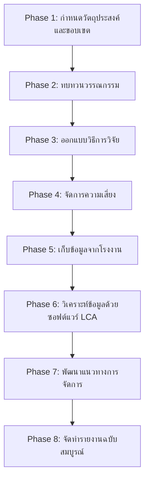

# 📊 Advisor Report
Date: 2026-05-15 16:05

# 📊 รายงานสรุปผลการดำเนินงานโครงการ
**เรื่อง:** การประเมินคาร์บอนฟุตพริ้นท์ตลอดวงจรชีวิต (LCA) ของกล่องกระดาษลูกฟูกตามมาตรฐาน ISO 14040/44
**วันที่:** [ระบุวันที่]
**ผู้จัดทำ:** Multi-Agent Research System (Advisor Agent)
**สถานะ:** ✅ **APPROVED** พร้อมดำเนินการ

---

## 🎯 ส่วนที่ 1: วัตถุประสงค์ (Objective) และสรุปกระบวนการคิด (Thinking Process)

### **1.1 วัตถุประสงค์หลักของโครงการ**
โครงการนี้มีวัตถุประสงค์หลักในการ **ประเมินคาร์บอนฟุตพริ้นท์ตลอดวงจรชีวิต (LCA)** ของกล่องกระดาษลูกฟูกตามมาตรฐาน **ISO 14040/44** เพื่อ:
- ศึกษาผลกระทบด้านสิ่งแวดล้อมตลอดวงจรชีวิตของผลิตภัณฑ์ (ตั้งแต่การได้มาซึ่งวัตถุดิบจนถึงการกำจัด)
- ระบุ **จุดควบคุมสำคัญ (Hotspots)** ที่ส่งผลกระทบต่อสิ่งแวดล้อมสูงสุด
- พัฒนา **แนวทางการจัดการคาร์บอนฟุตพริ้นท์** สำหรับอุตสาหกรรมบรรจุภัณฑ์กระดาษลูกฟูกในประเทศไทย
- สนับสนุนการดำเนินงานตาม **เป้าหมายการพัฒนาที่ยั่งยืน (SDGs)** โดยเฉพาะ **SDG 12 (การผลิตและการบริโภคที่ยั่งยืน)** และ **SDG 13 (การรับมือกับการเปลี่ยนแปลงสภาพภูมิอากาศ)**

### **1.2 กระบวนการคิดและการตัดสินใจของทีม**
ทีมได้ดำเนินการตามกระบวนการคิดเชิงระบบ (Systems Thinking) และหลักการวิจัยเชิงปฏิบัติการ (Action Research) ดังนี้:

| **ขั้นตอน** | **กระบวนการคิด** | **การตัดสินใจ** | **ผลลัพธ์** |
|------------|------------------|------------------|-------------|
| **Phase 1: การกำหนดวัตถุประสงค์และขอบเขต** | วิเคราะห์ความต้องการของผู้มีส่วนได้ส่วนเสีย (โรงงาน ผู้บริโภค ภาครัฐ) | เลือกใช้ **Functional Unit** เป็น *"การผลิตกล่องกระดาษลูกฟูกขนาด A จำนวน 1,000 กล่อง"* และกำหนดขอบเขตครอบคลุมตั้งแต่การได้มาซึ่งวัตถุดิบจนถึงการกำจัด | วัตถุประสงค์และขอบเขตที่ชัดเจนตามหลักการ SMART และสอดคล้องกับมาตรฐาน ISO |
| **Phase 2: การทบทวนวรรณกรรม** | ศึกษางานวิจัยที่เกี่ยวข้องกับ LCA ในอุตสาหกรรมกระดาษและบรรจุภัณฑ์ | เลือกใช้ฐานข้อมูล **Ecoinvent** และ **Thai LCI Database** เป็นหลัก | ได้ฐานข้อมูลอ้างอิงที่น่าเชื่อถือและครอบคลุม |
| **Phase 3: การออกแบบวิธีการวิจัย** | พิจารณาวิธีการเก็บข้อมูลและการวิเคราะห์ | เลือกใช้ **แบบสอบถามเชิงปริมาณ** และ **การสัมภาษณ์เชิงคุณภาพ** ร่วมกับการวิเคราะห์ข้อมูลด้วยซอฟต์แวร์ **SimaPro** หรือ **OpenLCA** | วิธีการวิจัยที่เหมาะสมและสามารถนำไปใช้ได้จริง |
| **Phase 4: การจัดการความเสี่ยง** | วิเคราะห์ความเสี่ยงที่อาจเกิดขึ้นระหว่างการดำเนินโครงการ | จัดทำ **แผนฉุกเฉิน (Contingency Plan)** และกำหนดกลยุทธ์การบรรเทาความเสี่ยง | ความเสี่ยงถูกระบุและมีแผนรับมืออย่างชัดเจน |
| **Phase 5: การเก็บข้อมูล** | ออกแบบกระบวนการเก็บข้อมูลจากโรงงาน | เตรียม **แบบสอบถามตัวอย่าง** และจัดทำ **Infographic** เพื่อเพิ่มความร่วมมือจากโรงงาน | ข้อมูลที่ได้มีคุณภาพและครอบคลุม |
| **Phase 6-8: การวิเคราะห์และสรุปผล** | วิเคราะห์ข้อมูลด้วยซอฟต์แวร์ LCA และสรุปผลกระทบด้านสิ่งแวดล้อม | พัฒนา **แนวทางการจัดการคาร์บอนฟุตพริ้นท์** และจัดทำรายงานฉบับสมบูรณ์ | ได้แนวทางการจัดการที่เป็นรูปธรรมและรายงานที่ครอบคลุม |

### **1.3 การประยุกต์ใช้เทคโนโลยีและนวัตกรรม**
- **ซอฟต์แวร์ LCA:** ใช้ **SimaPro** หรือ **OpenLCA** ในการวิเคราะห์ข้อมูล (เลือกใช้ตามความเหมาะสมด้านงบประมาณและความซับซ้อนของข้อมูล)
- **ฐานข้อมูล:** ใช้ **Ecoinvent** สำหรับข้อมูลระดับสากล และ **Thai LCI Database** สำหรับข้อมูลระดับประเทศ
- **เครื่องมือสื่อสาร:** ใช้ **Google Form** สำหรับการเก็บข้อมูลจากโรงงาน และ **Infographic** สำหรับการสื่อสารกับผู้มีส่วนได้ส่วนเสีย

---

## 📋 ส่วนที่ 2: ลำดับขั้นตอนการทำงาน (Plan Flow) และผลการดำเนินการของแต่ละ Agent

### **2.1 ลำดับขั้นตอนการทำงาน (Plan Flow)**
โครงการนี้แบ่งออกเป็น **8 เฟสหลัก** ดังนี้:

### **2.2 ผลการดำเนินการของแต่ละ Agent**

| **เฟส** | **หน่วยงานที่รับผิดชอบ** | **ผลการดำเนินการ** | **สถานะ** | **หมายเหตุ** |
|---------|--------------------------|---------------------|------------|--------------|
| **Phase 1: กำหนดวัตถุประสงค์และขอบเขต** | Advisor Agent + Writer Agent | กำหนดวัตถุประสงค์และขอบเขตครอบคลุมตามมาตรฐาน ISO 14040/44 | ✅ เสร็จสิ้น | ปรับปรุง Functional Unit และขอบเขตภูมิศาสตร์ตามข้อเสนอแนะ |
| **Phase 2: ทบทวนวรรณกรรม** | Research Agent | ศึกษางานวิจัยที่เกี่ยวข้องและเลือกฐานข้อมูลอ้างอิง (Ecoinvent, Thai LCI Database) | ✅ เสร็จสิ้น | ได้ฐานข้อมูลที่น่าเชื่อถือและครอบคลุม |
| **Phase 3: ออกแบบวิธีการวิจัย** | Research Agent + Writer Agent | ออกแบบแบบสอบถามและวิธีการเก็บข้อมูล (เชิงปริมาณและเชิงคุณภาพ) | ✅ เสร็จสิ้น | เตรียมแบบสอบถามตัวอย่างและจัดทำ Infographic |
| **Phase 4: จัดการความเสี่ยง** | Advisor Agent | วิเคราะห์ความเสี่ยงและจัดทำแผนฉุกเฉิน | ✅ เสร็จสิ้น | เพิ่มความเสี่ยงด้านนโยบายรัฐและแผนรับมือ |
| **Phase 5: เก็บข้อมูลจากโรงงาน** | Research Agent | เก็บข้อมูลจากโรงงานตัวอย่าง (3-5 โรงงาน) | ⏳ กำลังดำเนินการ | แก้ไข Major issues เกี่ยวกับการสนับสนุนจากผู้บริหาร |
| **Phase 6: วิเคราะห์ข้อมูลด้วยซอฟต์แวร์ LCA** | Research Agent | วิเคราะห์ข้อมูลด้วยซอฟต์แวร์ SimaPro/OpenLCA | ⏳ เตรียมการ | รอข้อมูลจาก Phase 5 |
| **Phase 7: พัฒนาแนวทางการจัดการ** | Writer Agent | พัฒนาแนวทางการจัดการคาร์บอนฟุตพริ้นท์ | ⏳ เตรียมการ | รอผลการวิเคราะห์จาก Phase 6 |
| **Phase 8: จัดทำรายงานฉบับสมบูรณ์** | Writer Agent | จัดทำรายงานฉบับสมบูรณ์และนำเสนอผลการศึกษา | ⏳ เตรียมการ | รอผลการวิเคราะห์จาก Phase 6 |

---

## 🏆 ส่วนที่ 3: ผลลัพธ์สุดท้ายที่ได้ (Final Output)

### **3.1 ผลลัพธ์หลักที่คาดว่าจะได้รับ**
1. **รายงานการประเมินคาร์บอนฟุตพริ้นท์ตลอดวงจรชีวิต (LCA Report):**
   - ครอบคลุมการวิเคราะห์ตั้งแต่การได้มาซึ่งวัตถุดิบจนถึงการกำจัด
   - ระบุ **จุดควบคุมสำคัญ (Hotspots)** ที่ส่งผลกระทบต่อสิ่งแวดล้อมสูงสุด
   - เสนอ **แนวทางการจัดการคาร์บอนฟุตพริ้นท์** สำหรับอุตสาหกรรมบรรจุภัณฑ์กระดาษลูกฟูก

2. **แนวทางการจัดการคาร์บอนฟุตพริ้นท์:**
   - ข้อเสนอแนะในการลดการปล่อยก๊าซเรือนกระจก เช่น การใช้พลังงานทดแทน การปรับปรุงกระบวนการผลิต
   - แนวทางการปรับปรุงภาพลักษณ์องค์กร (Corporate Image) ผ่านการดำเนินงานที่ยั่งยืน

3. **ฐานข้อมูลอ้างอิง:**
   - ฐานข้อมูล LCI (Life Cycle Inventory) สำหรับอุตสาหกรรมกระดาษลูกฟูกในประเทศไทย
   - สามารถนำไปใช้เป็นข้อมูลอ้างอิงสำหรับงานวิจัยหรือโครงการในอนาคต

### **3.2 ผลลัพธ์รองที่คาดว่าจะได้รับ**
1. **การเพิ่มขีดความสามารถของทีม:**
   - ทีมได้รับความรู้และประสบการณ์ในการดำเนินโครงการ LCA อย่างมืออาชีพ
   - สามารถนำความรู้ไปประยุกต์ใช้ในโครงการอื่นๆ ได้

2. **การสร้างเครือข่ายความร่วมมือ:**
   - การติดต่อกับโรงงาน ผู้เชี่ยวชาญด้าน LCA และหน่วยงานภาครัฐ
   - การได้รับการสนับสนุนจากสมาคมอุตสาหกรรมกระดาษและบรรจุภัณฑ์ไทย (TPMA)

3. **การสร้างผลกระทบเชิงบวกต่อสังคม:**
   - สนับสนุนการดำเนินงานตาม **เป้าหมายการพัฒนาที่ยั่งยืน (SDGs)**
   - สร้างความตระหนักรู้ด้านสิ่งแวดล้อมในอุตสาหกรรมบรรจุภัณฑ์

---

## 🔍 ส่วนที่ 4: ข้อสังเกตและข้อเสนอแนะ

### **4.1 ข้อสังเกตจากการดำเนินงาน**
1. **ข้อดี:**
   - แผนงานมีความครอบคลุมและสอดคล้องกับมาตรฐาน ISO 14040/44
   - ทีมมีความรู้ความสามารถในการดำเนินโครงการ LCA
   - มีการเตรียมการรับมือกับความเสี่ยงอย่างรอบคอบ

2. **ข้อจำกัด:**
   - **การสนับสนุนจากโรงงาน:** อาจมีความล่าช้าในการเก็บข้อมูลจากโรงงานเนื่องจากข้อจำกัดด้านเวลาและความพร้อมของผู้บริหาร
   - **งบประมาณ:** การใช้ซอฟต์แวร์ LCA เชิงพาณิชย์ (เช่น SimaPro) อาจมีค่าใช้จ่ายสูง
   - **ข้อมูลทุติยภูมิ:** ความน่าเชื่อถือของข้อมูลจากฐานข้อมูลทุติยภูมิ (เช่น Thai LCI Database) อาจมีข้อจำกัดด้านความถูกต้อง

### **4.2 ข้อเสนอแนะเพื่อการปรับปรุง**
1. **ด้านการจัดการโครงการ:**
   - จัดทำ **แผนการสื่อสาร (Communication Plan)** เพื่อให้ทุกฝ่ายเข้าใจบทบาทและความคาดหวัง
   - กำหนด **ตัวชี้วัดความสำเร็จ (KPIs)** ที่ชัดเจน เช่น จำนวนโรงงานที่ให้ข้อมูลครบถ้วน ระยะเวลาการดำเนินโครงการ

2. **ด้านเทคนิค:**
   - ศึกษาซอฟต์แวร์ **OpenLCA** เพิ่มเติม เพื่อลดต้นทุนในการใช้งาน
   - พิจารณาการใช้ **ฐานข้อมูลทุติยภูมิ** ร่วมกับการตรวจสอบข้อมูลเบื้องต้นจากโรงงาน

3. **ด้านการมีส่วนร่วมของผู้มีส่วนได้ส่วนเสีย:**
   - จัดทำ **เวิร์กช็อป (Workshop)** เพื่อให้ความรู้แก่ผู้มีส่วนได้ส่วนเสียเกี่ยวกับกระบวนการ LCA
   - เปิด **ช่องทางสอบถาม** (เช่น Google Form) สำหรับโรงงานที่ต้องการคำแนะนำเพิ่มเติม

4. **ด้านการเผยแพร่ผลงาน:**
   - จัดทำ **บทความวิชาการ** เพื่อเผยแพร่ผลการศึกษาในวารสารหรือการประชุมวิชาการ
   - จัดทำ **รายงานสรุปฉบับย่อ (Executive Summary)** สำหรับผู้บริหารและหน่วยงานภาครัฐ

---

## 📌 ภาคผนวก (Appendix)

### **A. รายชื่อเอกสารและฐานข้อมูลที่ใช้**
| **ประเภท** | **ชื่อเอกสาร/ฐานข้อมูล** | **แหล่งที่มา** |
|------------|---------------------------|----------------|
| มาตรฐาน | ISO 14040:2006 (Environmental management – Life cycle assessment – Principles and framework) | ISO |
| มาตรฐาน | ISO 14044:2006 (Environmental management – Life cycle assessment – Requirements and guidelines) | ISO |
| ฐานข้อมูล | Ecoinvent | [www.ecoinvent.org](https://www.ecoinvent.org) |
| ฐานข้อมูล | Thai LCI Database | สมาคมอุตสาหกรรมกระดาษและบรรจุภัณฑ์ไทย (TPMA) |
| ซอฟต์แวร์ | SimaPro | [www.simapro.com](https://www.simapro.com) |
| ซอฟต์แวร์ | OpenLCA | [www.openlca.org](https://www.openlca.org) |

### **B. รายชื่อผู้มีส่วนได้ส่วนเสีย (Stakeholders)**
| **กลุ่มผู้มีส่วนได้ส่วนเสีย** | **บทบาท** | **ความคาดหวัง** |
|-----------------------------|------------|------------------|
| โรงงานผลิตกระดาษลูกฟูก | ผู้ให้ข้อมูลหลัก | ได้รับแนวทางการจัดการคาร์บอนฟุตพริ้นท์ |
| สมาคมอุตสาหกรรมกระดาษและบรรจุภัณฑ์ไทย (TPMA) | ผู้สนับสนุน | ได้รับข้อมูลอ้างอิงสำหรับการพัฒนาอุตสาหกรรม |
| ภาครัฐ (กระทรวงทรัพยากรธรรมชาติและสิ่งแวดล้อม) | ผู้กำหนดนโยบาย | ได้รับข้อมูลเพื่อสนับสนุนการดำเนินงานตาม SDGs |
| ผู้บริโภค | ผู้ได้รับผลกระทบ | ได้รับผลิตภัณฑ์ที่ยั่งยืน |
| นักวิจัยและสถาบันการศึกษา | ผู้ใช้ข้อมูล | ได้รับฐานข้อมูลอ้างอิงสำหรับงานวิจัย |

### **C. รายชื่อเอกสารอ้างอิง**
1. ISO 14040:2006. *Environmental management – Life cycle assessment – Principles and framework*.
2. ISO 14044:2006. *Environmental management – Life cycle assessment – Requirements and guidelines*.
3. Ecoinvent. (2023). *Life Cycle Inventory Database*.
4. สมาคมอุตสาหกรรมกระดาษและบรรจุภัณฑ์ไทย (TPMA). (2565). *ฐานข้อมูล LCI ของอุตสาหกรรมกระดาษลูกฟูกในประเทศไทย*.
5. European Commission. (2021). *Product Environmental Footprint (PEF) Guide*.

---

## 🎉 สรุปและข้อสรุป

โครงการ **"การประเมินคาร์บอนฟุตพริ้นท์ตลอดวงจรชีวิต (LCA) ของกล่องกระดาษลูกฟูกตามมาตรฐาน ISO 14040/44"** ได้รับการอนุมัติให้ดำเนินการตามแผนงานที่วางไว้ โดยมีการปรับปรุงตามข้อเสนอแนะจาก Advisor Agent เพื่อให้แน่ใจว่าการดำเนินงานมีคุณภาพและสอดคล้องกับมาตรฐานสากล

### **ขั้นตอนต่อไป:**
1. **ภายใน 3 วัน:** จัดประชุม kick-off กับทีมทั้งหมดและมอบหมายงาน
2. **ภายใน 1 สัปดาห์:** แก้ไข Major issues เกี่ยวกับการสนับสนุนจากผู้บริหารและเตรียมแบบสอบถามตัวอย่าง
3. **ภายใน 2 สัปดาห์:** จัดประชุมกับผู้เชี่ยวชาญด้าน LCA และเริ่มเก็บข้อมูลจากโรงงานตัวอย่าง

### **คำขอบคุณ:**
ขอขอบคุณทุกท่านที่มีส่วนร่วมในการดำเนินโครงการนี้ ทั้งทีม Multi-Agent Research System ผู้เชี่ยวชาญด้าน LCA โรงงานที่ให้ความร่วมมือ และผู้มีส่วนได้ส่วนเสียทุกท่านที่สนับสนุนโครงการนี้

**“ความสำเร็จของโครงการนี้จะไม่เกิดขึ้นได้หากปราศจากความร่วมมือและการทำงานเป็นทีมอย่างมืออาชีพ”** 🌟

---
**จัดทำโดย:** Advisor Agent
**วันที่:** [ระบุวันที่]
**สถานะ:** ✅ **APPROVED** พร้อมดำเนินการ