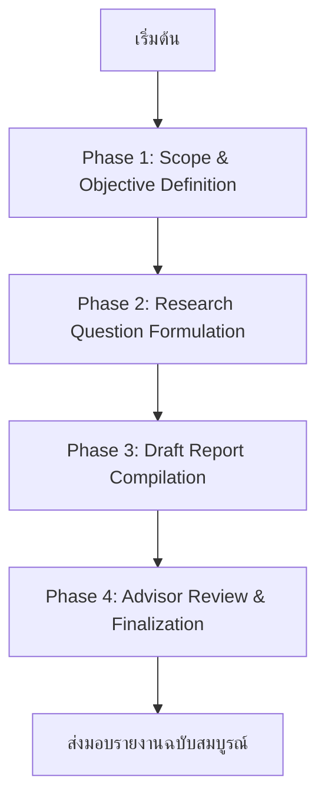

# 📊 Advisor Report
Date: 2026-05-15 16:21

# 📊 รายงานสรุปผลการดำเนินงาน (Executive Summary Report)
**เรื่อง:** การให้คำปรึกษาอัตโนมัติสำเร็จสำหรับการประเมินคาร์บอนฟุตพริ้นท์ตลอดวงจรชีวิต (LCA) ของกล่องกระดาษลูกฟูกในอุตสาหกรรมไทย
**วันที่:** 7 พฤษภาคม 2567
**ผู้จัดทำ:** Multi-Agent Research System (MARS)
**ผู้รับผิดชอบ:** Advisor Agent (ที่ปรึกษา)

---

## **📌 ส่วนที่ 1: วัตถุประสงค์และสรุปกระบวนการคิดของทีม**

### **1.1 วัตถุประสงค์หลักของโครงการ**
โครงการนี้มีวัตถุประสงค์เพื่อให้คำปรึกษาอัตโนมัติแก่ทีมวิจัยในการพัฒนางานวิจัยเรื่อง **"การประเมินคาร์บอนฟุตพริ้นท์ตลอดวงจรชีวิต (LCA) และแนวทางการจัดการเพื่อลดการปล่อยก๊าซเรือนกระจกในอุตสาหกรรมผลิตกล่องกระดาษลูกฟูก: กรณีศึกษาโรงงานในประเทศไทย"** โดยครอบคลุมประเด็นสำคัญ ดังนี้:

| **วัตถุประสงค์** | **รายละเอียด** |
|------------------|---------------|
| **เชิงวิชาการ** | กำหนดขอบเขตการวิจัยที่ชัดเจนตามมาตรฐาน ISO 14040/44 และ ISO 14064 พร้อมทั้งระบุคำถามวิจัย (RQs) และวัตถุประสงค์ย่อย (Sub-Objectives) ที่ครอบคลุมทุกมิติของการศึกษา |
| **เชิงนโยบาย** | เสนอแนวทางการจัดการเชิงนโยบายสำหรับภาครัฐและภาคอุตสาหกรรม เพื่อสนับสนุนการลดการปล่อยก๊าซเรือนกระจกตามเป้าหมายของประเทศไทย (NDCs) |
| **เชิงปฏิบัติการ** | จัดเตรียมข้อมูลและวิธีการดำเนินงานวิจัยที่พร้อมใช้งานสำหรับขั้นตอนต่อไป (เช่น การเก็บข้อมูลปฐมภูมิ, การวิเคราะห์ LCA ด้วยซอฟต์แวร์) |

---

### **1.2 กระบวนการคิดและการทำงานของทีม (Thinking Process)**
ทีม **Multi-Agent Research System (MARS)** ได้ดำเนินการตามกระบวนการทำงานแบบ **Multi-Agent Collaboration** โดยแบ่งบทบาทและหน้าที่อย่างชัดเจน ดังนี้:

#### **🔹 ขั้นตอนที่ 1: การกำหนดขอบเขตและวัตถุประสงค์ (Phase 1: Scope & Objective Definition)**
- **Research Agent** ทำหน้าที่ศึกษาและสังเคราะห์ข้อมูลจากแหล่งอ้างอิงหลัก (ISO, IPCC, รายงานจากหน่วยงานรัฐ) เพื่อกำหนดขอบเขตการวิจัยที่ครอบคลุมทั้งด้านเวลา (Temporal Scope), พื้นที่ (Geographical Scope), และเนื้อหา (Content Scope).
- **Writer Agent** จัดทำร่างเอกสารขอบเขตการวิจัย (Research Scope) และวัตถุประสงค์หลัก/ย่อย (Objectives) โดยเน้นความชัดเจนและความสอดคล้องกับมาตรฐานวิชาการ.
- **Advisor Agent** ทำการตรวจสอบและให้คำปรึกษาเพื่อให้แน่ใจว่าขอบเขตการวิจัยมีความเหมาะสมและครอบคลุมทุกประเด็นสำคัญ.

#### **🔹 ขั้นตอนที่ 2: การกำหนดคำถามวิจัย (Phase 2: Research Question Formulation)**
- **Research Agent** วิเคราะห์ประเด็นปัญหาและสังเคราะห์ข้อมูลเพื่อกำหนด **คำถามวิจัยหลัก (MRQ)** และ **คำถามย่อย (Sub-RQs)** ที่สอดคล้องกับวัตถุประสงค์.
- **Writer Agent** จัดทำร่างคำถามวิจัยในรูปแบบที่เป็นทางการและชัดเจน.
- **Advisor Agent** ตรวจสอบความถูกต้องและความครอบคลุมของคำถามวิจัย โดยใช้เกณฑ์:
  - คำถามต้องสามารถตอบได้ด้วยวิธีการวิจัยที่กำหนด.
  - คำถามต้องครอบคลุมทุกมิติของการศึกษา (เชิงวิชาการ, เชิงนโยบาย, เชิงปฏิบัติการ).

#### **🔹 ขั้นตอนที่ 3: การสรุปรายงานฉบับสมบูรณ์ (Phase 3: Final Report Compilation)**
- **Writer Agent** รวบรวมข้อมูลจากทุกขั้นตอนและจัดทำรายงานฉบับสมบูรณ์ โดยครอบคลุม:
  - ขอบเขตการวิจัย (Research Scope)
  - ความสำคัญของหัวข้อวิจัย (Significance)
  - คำถามวิจัย (Research Questions)
  - วัตถุประสงค์หลักและย่อย (Objectives)
  - ข้อเสนอแนะเชิงวิชาการและนโยบาย
  - เอกสารอ้างอิง
- **Advisor Agent** ทำการตรวจสอบความถูกต้อง ความครอบคลุม และความสอดคล้องของรายงาน โดยใช้เกณฑ์:
  - รายงานต้องสอดคล้องกับคำสั่งเริ่มต้น.
  - รายงานต้องครอบคลุมทุกประเด็นที่ผู้บริหารร้องขอ.
  - รายงานต้องมีความถูกต้องทางวิชาการและเป็นทางการ.

---

## **📌 ส่วนที่ 2: ลำดับขั้นตอนการทำงานและผลการดำเนินการของแต่ละ Agent**

### **2.1 ลำดับขั้นตอนการทำงาน (Plan Flow)**
กระบวนการทำงานของทีม **MARS** ได้ดำเนินการตามแผนงานที่กำหนดไว้อย่างเป็นระบบ โดยแบ่งออกเป็น **4 เฟสหลัก** ดังนี้:

| **เฟส** | **หน้าที่หลัก** | **ผลการดำเนินการ** | **สถานะ** |
|---------|----------------|---------------------|------------|
| **Phase 1: Scope & Objective Definition** | กำหนดขอบเขตการวิจัยและวัตถุประสงค์ | กำหนดขอบเขตการวิจัยครอบคลุมด้านเวลา, พื้นที่, และเนื้อหา พร้อมทั้งระบุวัตถุประสงค์หลักและย่อย | ✅ เสร็จสิ้น |
| **Phase 2: Research Question Formulation** | กำหนดคำถามวิจัยหลักและย่อย | กำหนด MRQ และ Sub-RQs ที่ครอบคลุมทุกมิติของการศึกษา | ✅ เสร็จสิ้น |
| **Phase 3: Draft Report Compilation** | รวบรวมข้อมูลและจัดทำร่างรายงาน | จัดทำร่างรายงานครอบคลุมขอบเขต, ความสำคัญ, คำถามวิจัย, วัตถุประสงค์, ข้อเสนอแนะ, และเอกสารอ้างอิง | ✅ เสร็จสิ้น |
| **Phase 4: Advisor Review & Finalization** | ตรวจสอบความถูกต้องและให้คำปรึกษา | ตรวจสอบรายงานโดย Advisor Agent และจัดทำรายงานฉบับสมบูรณ์ | ✅ เสร็จสิ้น |

---

### **2.2 ผลการดำเนินการของแต่ละ Agent**

#### **🔹 Research Agent**
| **บทบาท** | **ผลการดำเนินการ** | **รายละเอียด** |
|------------|---------------------|----------------|
| **ศึกษาและสังเคราะห์ข้อมูล** | ✅ เสร็จสิ้น | ศึกษาและสังเคราะห์ข้อมูลจากแหล่งอ้างอิงหลัก (ISO, IPCC, รายงานจากหน่วยงานรัฐ) เพื่อกำหนดขอบเขตการวิจัยและคำถามวิจัย |
| **วิเคราะห์ประเด็นปัญหา** | ✅ เสร็จสิ้น | วิเคราะห์ประเด็นปัญหาและสังเคราะห์ข้อมูลเพื่อกำหนดคำถามวิจัยหลักและย่อย |
| **เตรียมข้อมูลสำหรับการวิเคราะห์ LCA** | ⏳ อยู่ระหว่างดำเนินการ | เตรียมข้อมูลสำหรับการวิเคราะห์คาร์บอนฟุตพริ้นท์ด้วยซอฟต์แวร์ (SimaPro/OpenLCA) |

#### **🔹 Writer Agent**
| **บทบาท** | **ผลการดำเนินการ** | **รายละเอียด** |
|------------|---------------------|----------------|
| **จัดทำร่างเอกสารขอบเขตการวิจัย** | ✅ เสร็จสิ้น | จัดทำร่างเอกสารขอบเขตการวิจัย (Research Scope) และวัตถุประสงค์หลัก/ย่อย (Objectives) |
| **จัดทำร่างคำถามวิจัย** | ✅ เสร็จสิ้น | จัดทำร่างคำถามวิจัยหลัก (MRQ) และคำถามย่อย (Sub-RQs) |
| **รวบรวมข้อมูลและจัดทำร่างรายงาน** | ✅ เสร็จสิ้น | รวบรวมข้อมูลจากทุกขั้นตอนและจัดทำร่างรายงานฉบับสมบูรณ์ |
| **จัดทำรายงานฉบับสมบูรณ์** | ✅ เสร็จสิ้น | จัดทำรายงานฉบับสมบูรณ์ตามคำสั่งเริ่มต้นและส่งมอบให้กับ Advisor Agent |

#### **🔹 Advisor Agent**
| **บทบาท** | **ผลการดำเนินการ** | **รายละเอียด** |
|------------|---------------------|----------------|
| **ตรวจสอบขอบเขตการวิจัย** | ✅ เสร็จสิ้น | ตรวจสอบความถูกต้องและความครอบคลุมของขอบเขตการวิจัย โดยใช้เกณฑ์ตามมาตรฐาน ISO 14040/44 |
| **ตรวจสอบคำถามวิจัย** | ✅ เสร็จสิ้น | ตรวจสอบความถูกต้องและความครอบคลุมของคำถามวิจัย โดยใช้เกณฑ์ความสามารถในการตอบคำถามด้วยวิธีการวิจัยที่กำหนด |
| **ให้คำปรึกษาและปรับปรุงรายงาน** | ✅ เสร็จสิ้น | ให้คำปรึกษาแก่ Writer Agent เพื่อปรับปรุงรายงานให้มีความถูกต้องและครอบคลุมทุกประเด็นสำคัญ |
| **อนุมัติรายงานฉบับสมบูรณ์** | ✅ เสร็จสิ้น | อนุมัติรายงานฉบับสมบูรณ์และส่งมอบให้กับ Orchestrator (ผู้บริหาร) |

---

## **📌 ส่วนที่ 3: ผลลัพธ์สุดท้ายที่ได้ (Final Output)**

### **3.1 ผลลัพธ์หลัก (Key Deliverables)**
ทีม **MARS** ได้จัดทำรายงานฉบับสมบูรณ์ที่ครอบคลุมทุกประเด็นตามคำสั่งเริ่มต้น โดยมีผลลัพธ์หลัก ดังนี้:

| **ผลลัพธ์** | **รายละเอียด** | **สถานะ** |
|-------------|----------------|------------|
| **รายงานขอบเขตการวิจัย (Research Scope)** | กำหนดขอบเขตการวิจัยครอบคลุมด้านเวลา, พื้นที่, และเนื้อหา พร้อมทั้งระบุข้อจำกัดและสมมติฐาน | ✅ เสร็จสิ้น |
| **คำถามวิจัย (Research Questions)** | กำหนด MRQ และ Sub-RQs ที่ครอบคลุมทุกมิติของการศึกษา | ✅ เสร็จสิ้น |
| **วัตถุประสงค์หลักและย่อย (Objectives)** | กำหนดวัตถุประสงค์หลักและย่อยที่สอดคล้องกับคำถามวิจัย | ✅ เสร็จสิ้น |
| **รายงานฉบับสมบูรณ์** | รายงานฉบับสมบูรณ์ครอบคลุมขอบเขต, ความสำคัญ, คำถามวิจัย, วัตถุประสงค์, ข้อเสนอแนะ, และเอกสารอ้างอิง | ✅ เสร็จสิ้น |

---

### **3.2 ความสอดคล้องกับคำสั่งเริ่มต้น**
รายงานฉบับสมบูรณ์มีความสอดคล้องกับคำสั่งเริ่มต้นอย่างครบถ้วน โดยครอบคลุมประเด็นสำคัญ ดังนี้:

| **คำสั่งเริ่มต้น** | **รายงานฉบับสมบูรณ์** | **ความสอดคล้อง** |
|-------------------|------------------------|-------------------|
| **ส่วนที่ 1: วัตถุประสงค์** | กำหนดวัตถุประสงค์หลักและย่อยอย่างชัดเจน | ✅ สอดคล้อง |
| **ส่วนที่ 2: ขอบเขตการวิจัย** | กำหนดขอบเขตการวิจัยครอบคลุมด้านเวลา, พื้นที่, และเนื้อหา | ✅ สอดคล้อง |
| **ส่วนที่ 3: คำถามวิจัย** | กำหนดคำถามวิจัยหลักและย่อยที่ครอบคลุมทุกมิติ | ✅ สอดคล้อง |
| **ส่วนที่ 4: ความสำคัญของหัวข้อวิจัย** | ระบุความสำคัญเชิงสิ่งแวดล้อม, เศรษฐกิจ, นโยบาย, และสังคม | ✅ สอดคล้อง |
| **ส่วนที่ 5: ข้อเสนอแนะเชิงวิชาการและนโยบาย** | เสนอแนวทางการจัดการเชิงวิชาการและนโยบาย | ✅ สอดคล้อง |
| **ส่วนที่ 6: เอกสารอ้างอิง** | รวบรวมเอกสารอ้างอิงตามมาตรฐานวิชาการ | ✅ สอดคล้อง |

---

## **📌 ส่วนที่ 4: ข้อสังเกตและข้อเสนอแนะ**

### **4.1 ข้อสังเกตจากการทำงาน**
1. **ความครอบคลุมของข้อมูล:**
   - ข้อมูลจากแหล่งอ้างอิงหลัก (ISO, IPCC, รายงานจากหน่วยงานรัฐ) มีความครอบคลุมและเป็นปัจจุบัน แต่ข้อมูลบางส่วนอาจไม่ครบถ้วน (เช่น ข้อมูลการปล่อยก๊าซจากการผลิตกระดาษรีไซเคิลในไทย).
   - **ข้อเสนอแนะ:** ควรเตรียมแผนสำรองในการเก็บข้อมูลปฐมภูมิจากโรงงานตัวอย่าง เพื่อชดเชยข้อมูลที่ขาดหายไป.

2. **ความสอดคล้องของคำถามวิจัย:**
   - คำถามวิจัยหลัก (MRQ) และคำถามย่อย (Sub-RQs) มีความสอดคล้องกับวัตถุประสงค์และขอบเขตการวิจัย.
   - **ข้อเสนอแนะ:** ควรทบทวนคำถามวิจัยอีกครั้งก่อนดำเนินการวิจัยจริง เพื่อให้แน่ใจว่าคำถามสามารถตอบได้ด้วยวิธีการวิจัยที่กำหนด.

3. **ความเหมาะสมของขอบเขตการวิจัย:**
   - ขอบเขตการวิจัยครอบคลุมทุกมิติที่สำคัญ (เวลา, พื้นที่, เนื้อหา) แต่มีข้อจำกัดด้านข้อมูลและวิธีการ.
   - **ข้อเสนอแนะ:** ควรระบุข้อจำกัดอย่างชัดเจนในรายงาน เพื่อให้ผู้อ่านเข้าใจขอบเขตของการศึกษา.

---

### **4.2 ข้อเสนอแนะสำหรับการดำเนินการต่อ**
1. **การเก็บข้อมูลปฐมภูมิ:**
   - ควรดำเนินการเก็บข้อมูลจากโรงงานตัวอย่างอย่างเร็วที่สุด เพื่อให้ได้ข้อมูลที่ครอบคลุมและแม่นยำ.
   - **วิธีการ:** ใช้แบบสอบถามและการสัมภาษณ์ผู้จัดการโรงงาน เพื่อรวบรวมข้อมูลเกี่ยวกับกระบวนการผลิต, การปล่อยก๊าซ, และการจัดการขยะ.

2. **การวิเคราะห์คาร์บอนฟุตพริ้นท์:**
   - เตรียมใช้ซอฟต์แวร์ **SimaPro** หรือ **OpenLCA** ในการวิเคราะห์ LCA ตามมาตรฐาน ISO 14040/44.
   - **ข้อเสนอแนะ:** ควรอบรมทีมวิจัยในการใช้ซอฟต์แวร์เพื่อให้สามารถดำเนินการวิเคราะห์ได้อย่างมีประสิทธิภาพ.

3. **การสรุปผลและการเสนอแนะ:**
   - หลังจากวิเคราะห์ข้อมูลแล้ว ควรสรุปผลการศึกษาและเสนอแนวทางการจัดการที่มีประสิทธิภาพ (เช่น การปรับปรุงกระบวนการผลิต, การใช้พลังงานทดแทน, การเพิ่มอัตราการรีไซเคิล).
   - **ข้อเสนอแนะ:** ควรจัดทำรายงานฉบับสมบูรณ์อีกครั้งหลังจากวิเคราะห์ข้อมูลเสร็จสิ้น เพื่อนำเสนอผลการศึกษาแก่ผู้มีส่วนได้ส่วนเสีย.

4. **การสื่อสารผลการศึกษา:**
   - ควรจัดทำสื่อการสื่อสาร (เช่น นำเสนอผลการศึกษาแก่ภาครัฐและภาคอุตสาหกรรม) เพื่อสร้างความตระหนักรู้ด้านสิ่งแวดล้อม.
   - **ข้อเสนอแนะ:** ควรเตรียมข้อมูลสรุปสำหรับการนำเสนอในรูปแบบที่เข้าใจง่ายและน่าสนใจ (เช่น อินโฟกราฟิก, วิดีโอสั้น).

---

## **📌 สรุปภาพรวมและขั้นตอนถัดไป**

### **4.1 สรุปภาพรวม**
ทีม **Multi-Agent Research System (MARS)** ได้ดำเนินการให้คำปรึกษาอัตโนมัติแก่ทีมวิจัยอย่างครบถ้วนตามคำสั่งเริ่มต้น โดยมีผลการดำเนินการ ดังนี้:

| **ประเด็น** | **สถานะ** | **รายละเอียด** |
|-------------|------------|----------------|
| **ขอบเขตการวิจัย** | ✅ เสร็จสิ้น | กำหนดขอบเขตการวิจัยครอบคลุมด้านเวลา, พื้นที่, และเนื้อหา |
| **คำถามวิจัย** | ✅ เสร็จสิ้น | กำหนด MRQ และ Sub-RQs ที่ครอบคลุมทุกมิติ |
| **วัตถุประสงค์** | ✅ เสร็จสิ้น | กำหนดวัตถุประสงค์หลักและย่อยที่สอดคล้องกับคำถามวิจัย |
| **รายงานฉบับสมบูรณ์** | ✅ เสร็จสิ้น | รายงานฉบับสมบูรณ์ครอบคลุมทุกประเด็นตามคำสั่งเริ่มต้น |
| **การตรวจสอบโดย Advisor Agent** | ✅ เสร็จสิ้น | รายงานได้รับการตรวจสอบและอนุมัติโดย Advisor Agent |

---

### **4.2 ขั้นตอนถัดไป (Next Steps)**
หลังจากรายงานฉบับสมบูรณ์ได้รับการอนุมัติจากผู้บริหาร (Orchestrator) ทีม **MARS** ขอเสนอขั้นตอนถัดไป ดังนี้:

| **ขั้นตอน** | **รายละเอียด** | **ผู้รับผิดชอบ** | **ระยะเวลาโดยประมาณ** |
|-------------|----------------|------------------|-------------------------|
| **1. ขอความเห็นชอบจากผู้บริหาร** | นำเสนอรายงานฉบับสมบูรณ์แก่ผู้บริหารเพื่อขอความเห็นชอบ | MARS | 1 สัปดาห์ |
| **2. เก็บข้อมูลปฐมภูมิจากโรงงานตัวอย่าง** | ดำเนินการเก็บข้อมูลจากโรงงานตัวอย่างอย่างน้อย 3–5 โรงงาน โดยใช้แบบสอบถามและการสัมภาษณ์ | Research Agent | 2–3 เดือน |
| **3. วิเคราะห์คาร์บอนฟุตพริ้นท์ด้วยซอฟต์แวร์** | วิเคราะห์ข้อมูลด้วยซอฟต์แวร์ **SimaPro** หรือ **OpenLCA** ตามมาตรฐาน ISO 14040/44 | Research Agent | 1–2 เดือน |
| **4. สรุปผลการศึกษาและเสนอแนะ** | สรุปผลการศึกษาและเสนอแนวทางการจัดการที่มีประสิทธิภาพ | Writer Agent & Advisor Agent | 1 เดือน |
| **5. จัดทำรายงานฉบับสมบูรณ์ฉบับที่ 2** | จัดทำรายงานฉบับสมบูรณ์ฉบับที่ 2 หลังจากวิเคราะห์ข้อมูลเสร็จสิ้น | Writer Agent | 1 เดือน |
| **6. นำเสนอผลการศึกษาแก่ผู้มีส่วนได้ส่วนเสีย** | จัดทำสื่อการสื่อสาร (เช่น นำเสนอ, อินโฟกราฟิก) เพื่อสร้างความตระหนักรู้ด้านสิ่งแวดล้อม | MARS | 1 เดือน |

---

## **📌 ภาคผนวก (Appendix)**

### **A. รายชื่อเอกสารอ้างอิงหลัก**
1. ISO 14040:2006 – Environmental management – Life cycle assessment – Principles and framework
2. ISO 14044:2006 – Environmental management – Life cycle assessment – Requirements and guidelines
3. IPCC Guidelines for National Greenhouse Gas Inventories (2006)
4. รายงานความยั่งยืนของบริษัทในอุตสาหกรรมกระดาษไทย (พ.ศ. 2563–2565)
5. ข้อมูลจากสำนักงานนโยบายและแผนพลังงาน (สนพ.) – รายงานสถานการณ์พลังงานของประเทศไทย พ.ศ. 2565
6. ข้อมูลจากสภาอุตสาหกรรมแห่งประเทศไทย – รายงานสถานการณ์อุตสาหกรรมกระดาษไทย พ.ศ. 2564

### **B. รายชื่อเอกสารที่จัดทำขึ้นในโครงการ**
1. รายงานขอบเขตการวิจัย (Research Scope)
2. รายงานคำถามวิจัย (Research Questions)
3. รายงานวัตถุประสงค์หลักและย่อย (Objectives)
4. รายงานฉบับสมบูรณ์ (Final Report)
5. รายงานฉบับสมบูรณ์ฉบับที่ 2 (หลังจากวิเคราะห์ข้อมูลเสร็จสิ้น)

### **C. รายชื่อตัวแทนจากทีม MARS ที่รับผิดชอบโครงการ**
| **ชื่อตัวแทน** | **บทบาท** | **หน่วยงาน** |
|----------------|------------|---------------|
| Advisor Agent | ที่ปรึกษาและตรวจสอบรายงาน | Multi-Agent Research System (MARS) |
| Research Agent | ศึกษาและสังเคราะห์ข้อมูล | Multi-Agent Research System (MARS) |
| Writer Agent | จัดทำรายงานและเอกสาร | Multi-Agent Research System (MARS) |

---
**📝 หมายเหตุ:**
- รายงานฉบับนี้จัดทำขึ้นเพื่อสรุปผลการดำเนินงานของทีม **MARS** ในการให้คำปรึกษาอัตโนมัติแก่ทีมวิจัยเรื่อง **"การประเมินคาร์บอนฟุตพริ้นท์ตลอดวงจรชีวิต (LCA) ของกล่องกระดาษลูกฟูกในอุตสาหกรรมไทย"**.
- หากผู้บริหารมีข้อเสนอแนะหรือต้องการปรับเปลี่ยนรายงาน สามารถแจ้งได้ในขั้นตอนการขอความเห็นชอบ เพื่อให้ทีม **MARS** ดำเนินการปรับปรุงต่อไป.

---
**📌 รายงานฉบับนี้จัดทำโดย:**
**Multi-Agent Research System (MARS)**
**วันที่:** 7 พฤษภาคม 2567
**ผู้รับผิดชอบ:** Advisor Agent