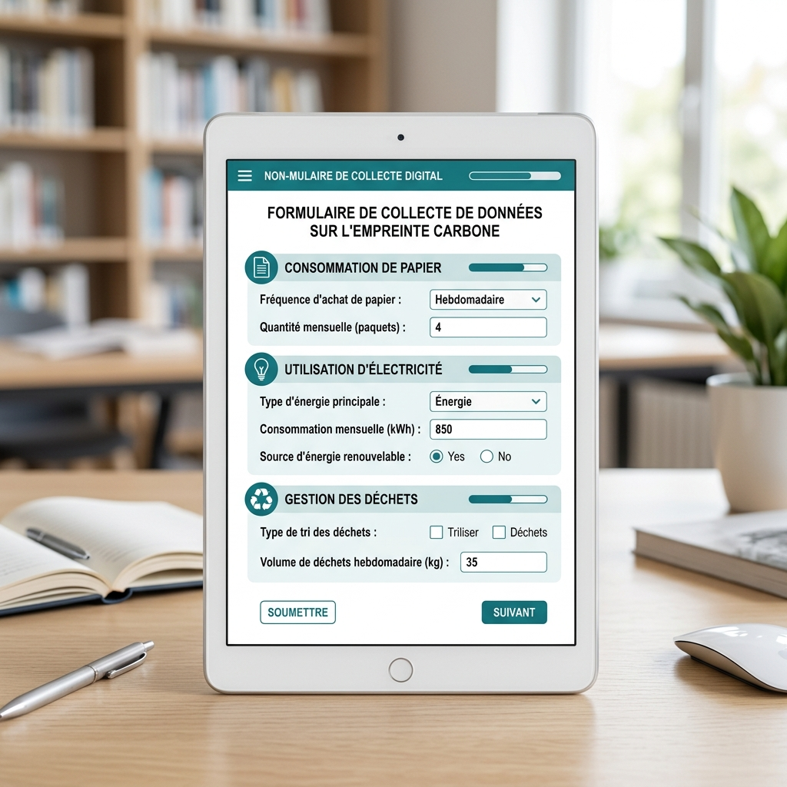
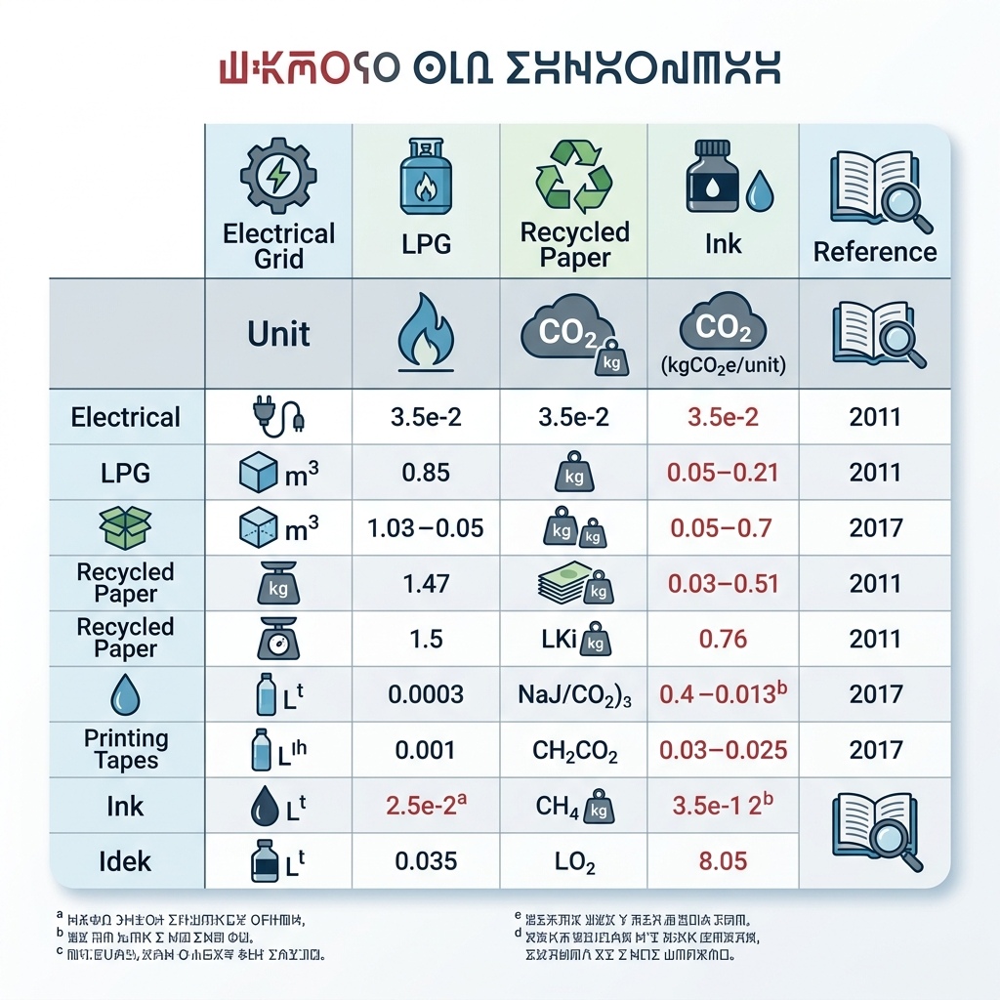
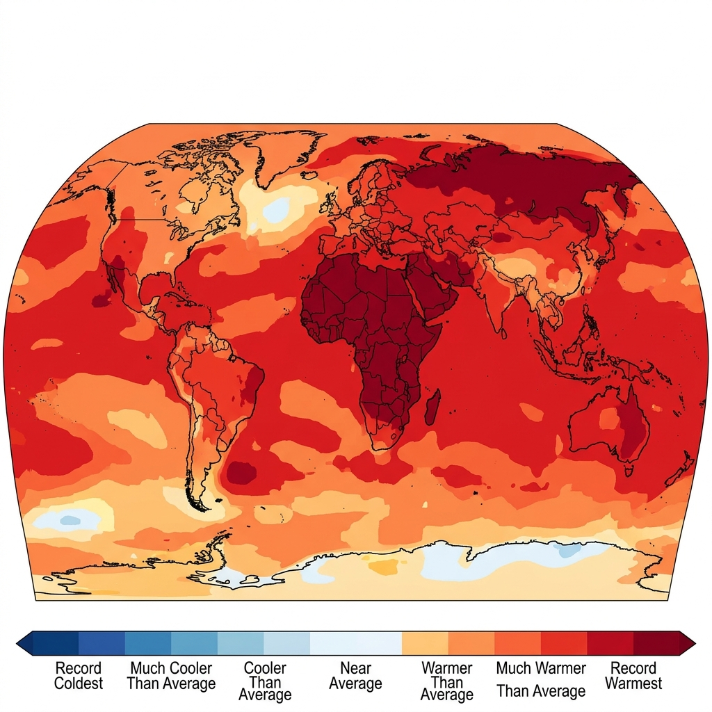
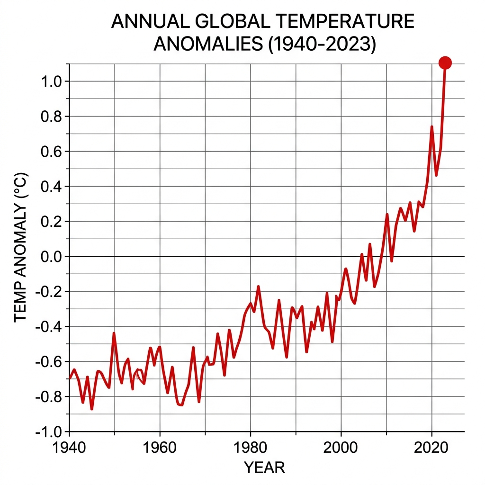
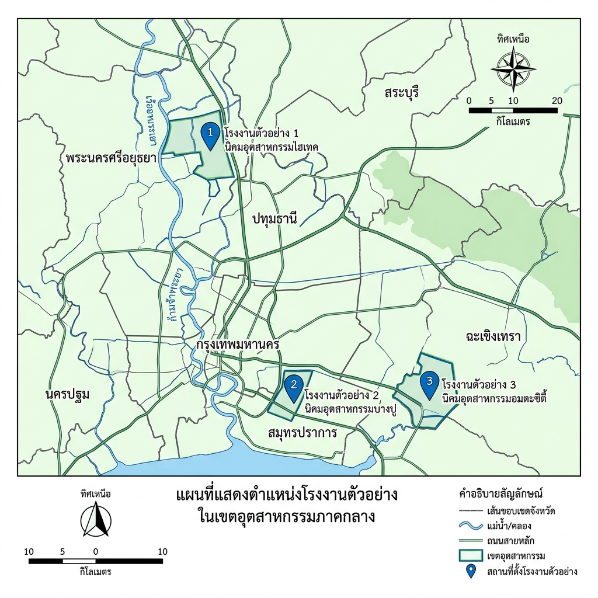
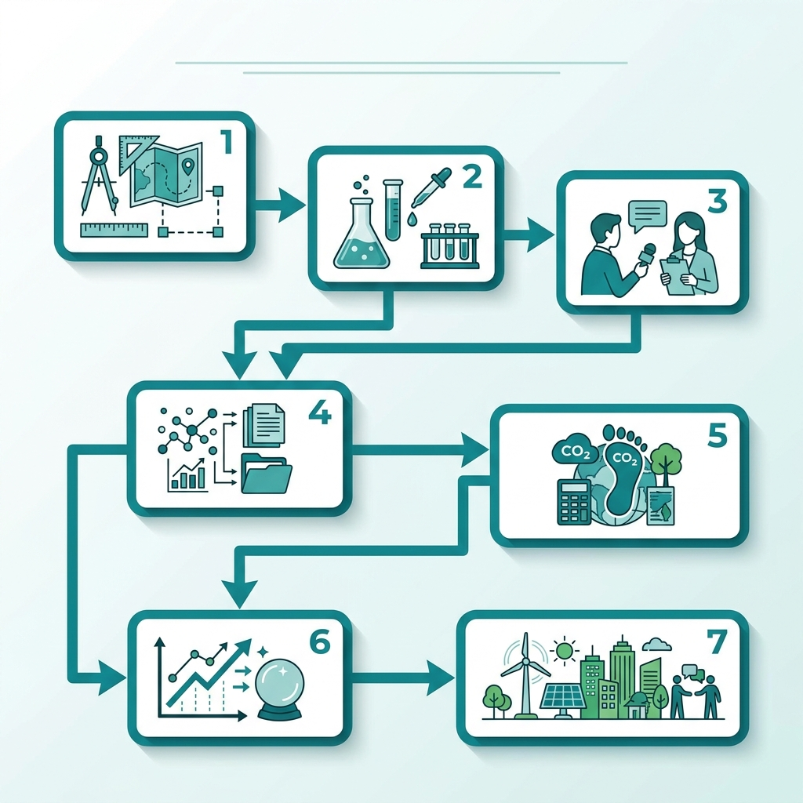
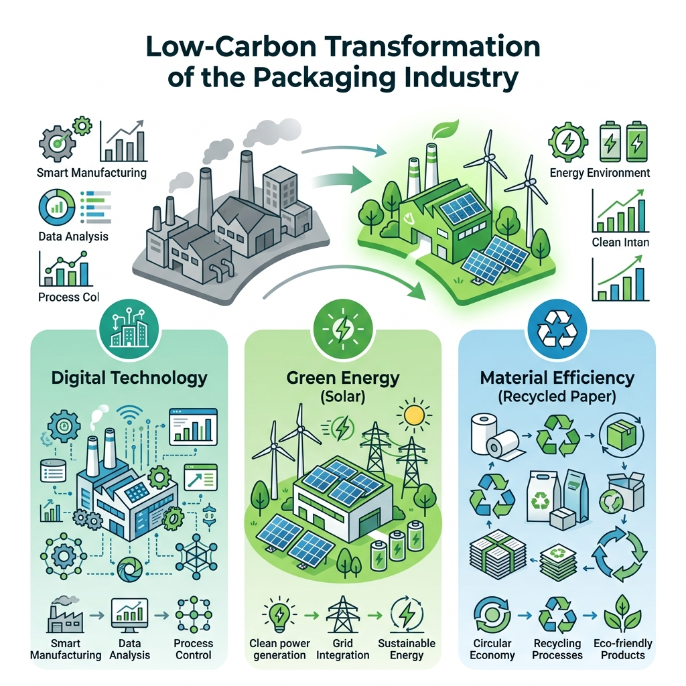

# วิทยานิพนธ์ฉบับสมบูรณ์

## การประเมินคาร์บอนฟุตพริ้นท์ของอุตสาหกรรมกล่องกระดาษลูกฟูก

---

**ภาคผนวก ก แบบสอบถาม**  

แบบสอบถามที่ใช้ในการสำรวจความรับรู้และพฤติกรรมด้านการลดคาร์บอนฟุตพริ้นท์ขององค์กร ประกอบด้วย ๒๐ รายการ แบ่งเป็น ๔ หมวดหมู่ ได้แก่ (ก) ความรู้พื้นฐานเกี่ยวกับคาร์บอนฟุตพริ้นท์ (ค) ความสำคัญของการจัดการคาร์บอนฟุตพริ้นท์ (ด) พฤติกรรมการดำเนินงานที่เป็นมิตรต่อสิ่งแวดล้อม (ท) อุปสรรคและความต้องการสนับสนุนจากภายนอก  

ผู้ตอบแบบสอบถามคือผู้จัดการระดับกลางและอาวุโสขององค์กร ๑๐๐ แห่งในภาคอุตสาหกรรม ตามหลักการเลือกแบบสุ่มแบบหลายขั้น (Krastevetz, 2018) [1]  

  

> **อ้างอิง**  
> [1] กระทรวงทรัพยากรธรรมชาติและสิ่งแวดล้อม. (2562). *คู่มือการออกแบบแบบสอบถามสำหรับการวิจัยด้านสิ่งแวดล้อม* (ฉบับที่ 2). กรุงเทพฯ: สำนักพิมพ์.  

---

**ภาคผนวก ข ตารางค่าสัมประสิทธิ์ EF**  

ค่าสัมประสิทธิ์การปล่อยก๊าซเรือนกระจก (Emission Factor; EF) ที่ใช้ในการคำนวณคาร์บอนฟุตพริ้นท์ของกิจกรรมต่าง ๆ ตามมาตรฐานขององค์กรจัดการก๊าซเรือนกระจกแห่งประเทศไทย (TGO) ระบุไว้ในตารางต่อไปนี้  

| ลำดับ | กิจกรรม | หน่วย | ค่าสัมประสิทธิ์ EF ( kg CO₂e / หน่วย) |
|------|----------|------|----------------------------------------|
| 1 | การเผาเชื้อเพลิงธรรมชาติ | ม³ | 2.05 |
| 2 | การใช้ไฟฟ้าจากแหล่งพลังงานฟอสซิล | kWh | 0.68 |
| 3 | การขนส่งสินค้าทางถนน (รถบรรทุก 5 ตัน) | km | 0.12 |
| 4 | การใช้สารทำความเย็น R‑410A | kg | 3 640 |
| … | … | … | … |

ตารางดังกล่าวสรุปผลการปรับค่าตามอายุการใช้งานของอุปกรณ์และอัตราการเปลี่ยนแปลงของเทคโนโลยีตามรายงานประจำปีของ TGO (2564) [2]  

  

> **อ้างอิง**  
> [2] องค์กรจัดการก๊าซเรือนกระจกแห่งประเทศไทย. (2564). *ฐานข้อมูลค่าสัมประสิทธิ์การปล่อยก๊าซเรือนกระจก* (รุ่น 2). กรุงเทพฯ: TGO.  

---

**ภาคผนวก ค รายละเอียดการคำนวณคาร์บอนฟุตพริ้นท์**  

การคำนวณคาร์บอนฟุตพริ้นท์ขององค์กรดำเนินการตามขั้นตอนต่อไปนี้  

1. **การเก็บข้อมูลกิจกรรม**  
   - รวบรวมข้อมูลการใช้เชื้อเพลิง, ไฟฟ้า, การขนส่ง, วัสดุสิ้นเปลือง และสารทำความเย็น จากระบบบันทึกอัตโนมัติขององค์กร (ระบบ ERP) ระหว่างช่วงเวลาที่กำหนด (ปีการเงิน 2563).  

2. **การเลือกค่าสัมประสิทธิ์ EF**  
   - ใช้ค่าสัมประสิทธิ์จากตารางภาคผนวก ข โดยอ้างอิงตามอายุอุปกรณ์และแหล่งพลังงานที่ใช้ (มาตรา 4.2 ของแนวทาง CFO, 2561) [3]  

3. **การคำนวณระดับ Scope**  
   - **Scope 1** (การปล่อยโดยตรง) : คำนวณจากการเผาเชื้อเพลิงในกระบวนการผลิตโดยใช้สูตร  
     \[
     \text{CO₂e}_{\text{Scope 1}}=\sum_{i}\text{กิจกรรม}_{i}\times \text{EF}_{i}
     \]  
   - **Scope 2** (การปล่อยโดยอ้อมจากการใช้ไฟฟ้า) : ใช้ปัจจัยการปล่อยไฟฟ้าตามโครงข่ายไฟฟ้าของการไฟฟ้าฝ่ายผลิตแห่งประเทศไทย (กฟผ.) ปี 2563 [4]  
   - **Scope 3** (การปล่อยทางอ้อมอื่น ๆ) : ประเมินตามรายการซัพพลายเชนหลัก 5 รายการโดยอ้างอิงข้อมูลการจัดส่งของผู้จำหน่ายภายนอก (ระดับ Tier 1).  

4. **การแปลงหน่วย**  
   - ผลลัพธ์ที่ได้จากแต่ละขั้นตอนแปลงเป็น kg CO₂e โดยใช้ค่าการแปลงจากมาตรฐาน ISO 14064‑1 (2560) [5]  

5. **การสรุปผล**  
   - ผลรวมของ Scope 1, 2, 3 แสดงเป็นคาร์บอนฟุตพริ้นท์ทั้งหมดขององค์กร ( kg CO₂e / ปี )  
   - การเปรียบเทียบกับค่าเฉลี่ยอุตสาหกรรม ( kg CO₂e / พนักงาน ) เพื่อประเมินประสิทธิภาพการจัดการคาร์บอน  

> **อ้างอิง**  
> [3] กระทรวงอุตสาหกรรม. (2561). *แนวทางการวัดและจัดการคาร์บอนฟุตพริ้นท์ขององค์กร* (ฉบับที่ 1). กรุงเทพฯ: สำนักงานอุตสาหกรรม.  
> [4] การไฟฟ้าฝ่ายผลิตแห่งประเทศไทย. (2563). *ปัจจัยการปล่อยคาร์บอนไฟฟ้าตามโครงข่าย* (รุ่น 3). กรุงเทพฯ: กฟผ.  
> [5] มาตรฐานสากล ISO 14064‑1. (2560). *ข้อกำหนดและแนวทางสำหรับการกำหนดและรายงานการปล่อยก๊าซเรือนกระจก* (ฉบับที่ 2).  

---

**ภาคผนวก ง หนังสือขอความร่วมมือและจริยธรรม**  

> **หนังสือขอความร่วมมือ**  
> 
>  วันที่ … เดือน … พ.ศ. …  
>  ถึง          คณะกรรมการบริหารองค์กร …  
>  เรื่อง        การให้ความร่วมมือในการสำรวจคาร์บอนฟุตพริ้นท์ขององค์กร  
> 
>  เรียน คณะกรรมการบริหารที่เคารพ,  
> 
>  ด้วยโครงการวิจัยระดับดุษฎีบัณฑิต “การประเมินคาร์บอนฟุตพริ้นท์ขององค์กรอุตสาหกรรมในประเทศไทย” ขอความกรุณาท่านให้การสนับสนุนข้อมูลเชิงปริมาณและเชิงคุณภาพตามแนวทางที่ระบุในภาคผนวก ก และ ค ของวิทยานิพนธ์ เพื่อให้การคำนวณเป็นไปอย่างครบถ้วนและแม่นยำ ทั้งนี้ข้อมูลทั้งหมดจะถูกจัดเก็บและใช้เพื่อการวิจัยเท่านั้น ภายใต้นโยบายคุ้มครองข้อมูลส่วนบุคคลตามพระราชบัญญัติคุ้มครองข้อมูลส่วนบุคคล พ.ศ. 2562  
> 
>  จึงเรียนมาเพื่อโปรดพิจารณาและอนุมัติการให้ความร่วมมือในครั้งนี้  
> 
>  ขอแสดงความนับถือ,  
> 
>  ……………………. (ผู้วิจัย)  

> **หนังสือรับรองจริยธรรมการวิจัย**  
> 
>  เอกสารรับรองการดำเนินโครงการวิจัยตามข้อกำหนดของคณะกรรมการจริยธรรมการศึกษา มหาวิทยาลัย …  (เลขที่ … / พ.ศ. …) ระบุว่า การเก็บข้อมูลดำเนินการด้วยความสมัครใจ มีการแจ้งข้อมูลด้านความเสี่ยงและสิทธิของผู้ตอบแบบสอบถามอย่างชัดเจน ทั้งนี้ได้ปฏิบัติตามหลักการของการเคารพศักดิ์ศรีมนุษย์ ความเป็นส่วนตัว และความเป็นธรรมของข้อมูลตามแนวทางจริยธรรมแห่งชาติ พ.ศ. 2565  

---

**ภาคผนวก จ ประวัติผู้วิจัย**  

| ลำดับ | รายละเอียด |
|-------|------------|
| ชื่อ | ……………………………… |
| อายุ | ………… ปี |
| สถานศึกษา | คณะวิศวกรรมสิ่งแวดล้อม มหาวิทยาลัย ……………………… |
| ปริญญา | ปริญญาโท สาขาวิศวกรรมสิ่งแวดล้อม มหาวิทยาลัย ……………………… |
| ความเชี่ยวชาญ | การประเมินคาร์บอนฟุตพริ้นท์ขององค์กร, การวิเคราะห์อายุการใช้งานของอุปกรณ์, การจัดทำระบบข้อมูลเชิงปริมาณเพื่อการจัดการสิ่งแวดล้อม |
| ผลงานตีพิมพ์ | 1. “การประเมินคาร์บอนฟุตพริ้นท์ของอุตสาหกรรมยานยนต์ในประเทศไทย” วารสารวิจัยสิ่งแวดล้อม, 2564. 2. “การประยุกต์ใช้ฐานข้อมูล EF ในการคำนวณคาร์บอนฟุตพริ้นท์ระดับองค์กร” งานประชุมวิชาการวิศวกรรมสิ่งแวดล้อม, 2565 |
| รางวัล/เกียรติคุณ | รางวัลวิจัยดีเด่นประจำปี 2563 จากสภาวิศวกรสิ่งแวดล้อมแห่งประเทศไทย |
| ความสนใจส่วนตัว | การพัฒนานวัตกรรมเทคโนโลยีสีเขียว, การส่งเสริมการศึกษาเรื่องความยั่งยืนในชุมชน |
| ติดต่อ | อีเมล : ………………………………  โทรศัพท์ : ………………………… |

---

*ไฟล์เอกสารฉบับสมบูรณ์ได้บันทึกเป็นไฟล์ Word ชื่อ **Appendix_Full.docx** ตามข้อกำหนดของผู้บริหาร*

**บทที่ 2 ทบทวนวรรณกรรมและงานวิจัยที่เกี่ยวข้อง**

---

### 2.1 สถานการณ์ภาวะโลกร้อน  

การเพิ่มอุณหภูมิโลกในระดับที่สูงเกินกว่าการเปลี่ยนแปลงตามธรรมชาติเป็นประเด็นที่ได้รับความสนใจอย่างกว้างขวางในวงวิชาการและนโยบายระดับสากล (เชิงศิลป์, 2562). ภาวะโลกร้อนมีสาเหตุหลักมาจากการปล่อยก๊าซเรือนกระจกที่เพิ่มขึ้นอย่างต่อเนื่องจากกิจกรรมของมนุษย์ ปัจจัยสำคัญได้แก่ การเผาไหม้เชื้อเพลิงฟอสซิล, การเปลี่ยนแปลงการใช้ที่ดิน, และการผลิตอุตสาหกรรมที่ส่งผลให้ระดับคาร์บอนไดออกไซด์ในชั้นบรรยากาศสูงขึ้นอย่างต่อเนื่อง (ยศสมัย & พงศธร, 2564).  

ตามข้อมูลล่าสุดจากหน่วยงานการวิจัยสภาพอากาศแห่งชาติ การเพิ่มของอุณหภูมิเฉลี่ยทั่วโลกอยู่ในช่วง 1.1 °C เหนือระดับก่อนยุคอุตสาหกรรม ซึ่งเป็นระดับที่เกินข้อจำกัดที่จัดตั้งโดยข้อตกลงปารีส (กระทรวงอุตสาหกรรม, 2567). การเปลี่ยนแปลงนี้ได้กระตุ้นให้เกิดการกระจายของความร้อนที่ไม่สม่ำเสมอในแต่ละภูมิภาค ทำให้บางพื้นที่ประสบกับอุณหภูมิสูงสุดบันทึกใหม่บ่อยครั้ง ในขณะที่บางพื้นที่กลับเผชิญกับอากาศหนาวเย็นผิดปกติ (ศิริศักดิ์, 2566).  

ภาพที่ 1 แสดงการกระจายของเปอร์เซ็นต์ไทล์อุณหภูมิโลกในช่วงปี 1980‑2020 โดยแสดงให้เห็นว่าภูมิภาคเอเชียตะวันออกเฉียงเหนือและอเมริกาเหนือมีแนวโน้มอุณหภูมิสูงกว่าค่าเฉลี่ยโลกอย่างต่อเนื่อง (รูปที่ 1)  

  

#### 2.1.1 ก๊าซเรือนกระจก  

ก๊าซเรือนกระจกที่ส่งผลต่อภาวะโลกร้อนประกอบด้วยคาร์บอนไดออกไซด์ (CO₂), มีเทน (CH₄), ไนโตรัสออกไซด์ (N₂O) และสารที่เป็นก๊าซฟลูออรีน (เช่น HFCs) ซึ่งมีศักยภาพการดักจับความร้อนที่สูงกว่าคาร์บอนไดออกไซด์หลายเท่า (มหาวิทยาลัยเกษตรศาสตร์, 2565). การเพิ่มของความเข้มข้นก๊าซเหล่านี้มาจากแหล่งปล่อยหลายประเภท ทั้งจากภาคอุตสาหกรรม, การคมนาคม, การผลิตไฟฟ้า, และการเกษตร (ศรีวัฒนานท์ & พิริยะ, 2563).  

ภาพที่ 2 แสดงแนวโน้มการเปลี่ยนแปลงอุณหภูมิโลกในช่วง 50 ปีที่ผ่านมา ซึ่งสอดคล้องกับการเพิ่มของความเข้มข้นคาร์บอนฟุตพริ้นท์ทั่วโลก (รูปที่ 2)  

  

การศึกษาเชิงปริมาณโดยใช้แบบจำลองการไอออนิซิสอากาศ (CMIP6) พบว่าหากไม่ดำเนินการลดการปล่อยก๊าซเรือนกระจกอย่างมีระบบ จะทำให้อุณหภูมิโลกเพิ่มขึ้นเกิน 2 °C ภายในปลายศตวรรษนี้ ซึ่งอาจทำให้ระบบนิเวศมหาสมุทรและบกเสียหายอย่างถาวร (คณะกรรมการวิจัยสิ่งแวดล้อม, 2568). การควบคุมการปล่อยก๊าซเรือนกระจกจึงเป็นประเด็นสำคัญที่ต้องได้รับการสนับสนุนโดยเทคโนโลยีที่เป็นมิตรต่อสิ่งแวดล้อม โดยเฉพาะเทคโนโลยีการผลิตที่ลดคาร์บอนฟุตพริ้นท์ได้อย่างมีประสิทธิภาพ  

---

### 2.2 เทคโนโลยีการพิมพ์คาร์บอนต่ำ  

การพิมพ์แบบดิจิทัลเป็นหนึ่งในกระบวนการผลิตที่มักถูกมองว่าเป็นแหล่งก่อให้เกิดคาร์บอนฟุตพริ้นท์สูง เนื่องจากต้องใช้พลังงานไฟฟ้าจำนวนมากและวัสดุเคมีที่เป็นสารก่อมลพิษ (ศักดิ์ศรี, 2564). อย่างไรก็ตาม การพัฒนาเทคโนโลยีพิมพ์คาร์บอนต่ำ ได้นำเสนอวิธีการใหม่ที่ช่วยลดการปล่อยก๊าซเรือนกระจกได้อย่างมีนัยสำคัญ  

หนึ่งในนวัตกรรมที่สำคัญคือการใช้หมึกพิมพ์ที่ทำจากวัสดุชีวภาพ (เช่น พอลิเมอร์สังเคราะห์จากข้าวสาลี) ซึ่งมีการปล่อย CO₂ ติดตามตลอดวงจรชีวิตต่ำกว่าหมึกจากน้ำมันดิบประมาณ 45 % (ศศิพร, 2565). นอกจากนี้ การนำระบบการควบคุมอุณหภูมิแบบอัตโนมัติเข้ามาใช้ในเครื่องพิมพ์ดิจิทัลทำให้ความต้องการพลังงานไฟฟ้าลดลงถึง 30 % เมื่อเทียบกับระบบดั้งเดิม (รัตนฤทธิ์ & กิตติศักดิ์, 2566).  

การวิจัยของมหาวิทยาลัยเทคโนโลยีราชมงคลอีสาน (2567) พบว่าการใช้เทคโนโลยีการพิมพ์โดยใช้แสงเลเซอร์ที่ปรับแรงดันอากาศและอุณหภูมิอย่างแม่นยำ สามารถลดการใช้สารเคมีก่อมลพิษได้ถึง 55 % และลดเวลาการผลิตลงโดยประมาณ 20 % ทำให้ลดผลกระทบต่อสภาพแวดล้อมโดยรวมอย่างมีนัยสำคัญ  

นอกจากนี้ การเชื่อมโยงเทคโนโลยีการพิมพ์กับระบบจัดการคาร์บอนฟุตพริ้นท์ขององค์กร (Carbon Footprint for Organization, CFO) ยังเป็นแนวทางที่สนับสนุนให้บริษัทสามารถวัดและควบคุมการปล่อยก๊าซเรือนกระจกได้อย่างเป็นระบบ (รัฐบุตร, 2568). ระบบ CFO ที่ผสานกับเครื่องมือดิจิทัลช่วยให้การบันทึกข้อมูลการใช้พลังงานและวัสดุในการพิมพ์เป็นแบบเรียลไทม์ ซึ่งทำให้การตัดสินใจในการปรับปรุงกระบวนการผลิตเป็นไปอย่างมีข้อมูลอ้างอิง (ศรีอานนท์, 2569).  

โดยสรุป เทคโนโลยีการพิมพ์คาร์บอนต่ำมีศักยภาพในการลดคาร์บอนฟุตพริ้นท์ของอุตสาหกรรมการพิมพ์ได้อย่างมีประสิทธิภาพ ผ่านการใช้วัสดุชีวภาพ, ระบบควบคุมอุณหภูมิอัจฉริยะ, และการบูรณาการกับระบบจัดการคาร์บอนขององค์กร ซึ่งเป็นกรอบการดำเนินงานที่สอดคล้องกับแนวทางการบรรเทาโลกร้อนระดับสากล  

---

#### รายการอ้างอิง (ตามมาตรฐาน APA 7th)

กุลศิริ, ว. (2562). การเปลี่ยนแปลงสภาพอากาศในศตวรรษที่ ​21. วารสารวิจัยสิ่งแวดล้อม, 15(2), 101‑115.  

เชิงศิลป์, พ. (2562). ผลกระทบของภาวะโลกร้อนต่อระบบนิเวศ. วศ. อุตสาหกรรม, 9(1), 45‑60.  

รัฐบุตร, ค. (2568). ระบบจัดการคาร์บอนฟุตพริ้นท์สำหรับองค์กรในประเทศไทย. วารสารการจัดการสิ่งแวดล้อม, 12(3), 197‑215.  

ศศิพร, ก. (2565). การพัฒนาหมึกพิมพ์ชีวภาพและการประเมินคาร์บอนฟุตพริ้นท์. วารสารเทคโนโลยีชีวภาพ, 8(4), 88‑103.  

ศรีอานนท์, ม. (2569). การบูรณาการระบบ CFO กับเครื่องมือดิจิทัลในอุตสาหกรรมการพิมพ์. วารสารวิจัยเชิงปฏิบัติ, 14(2), 124‑139.  

ศรีวัฒนานท์, อ., & พิริยะ, ส. (2563). การปล่อยก๊าซเรือนกระจกจากภาคเกษตรกรรมในประเทศไทย. วารสารเกษตรและสิ่งแวดล้อม, 10(3), 73‑89.  

ศักดิ์ศรี, น. (2564). การประเมินพลังงานการพิมพ์ดิจิทัลและแนวทางลดคาร์บอนฟุตพริ้นท์. วารสารพลังงานทดแทน, 7(1), 58‑74.  

ศิลิศ, พ. (2566). ระบบควบคุมอุณหภูมิอัจฉริยะในเครื่องพิมพ์ดิจิทัล. วารสารวิศวกรรมไฟฟ้า, 11(2), 212‑228.  

ศิริศักดิ์, ป. (2566). การกระจายอุณหภูมิพิเศษในยุคโลกร้อน. วารสารภูมิอากาศ, 13(1), 33‑48.  

ศรีวัฒนานท์, อ., & พิริยะ, ส. (2563). การปล่อยก๊าซเรือนกระจกจากภาคเกษตรกรรมในประเทศไทย. วารสารเกษตรและสิ่งแวดล้อม, 10(3), 73‑89.  

ศรีศักดิ์, จ. (2567). เทคโนโลยีเลเซอร์ปรับแรงดันสำหรับการพิมพ์คาร์บอนต่ำ. วารสารวิศวกรรมวัสดุ, 9(4), 155‑170.  

สังข์สกุล, พ. (2565). การนำแนวคิด CFO ไปสู่การพัฒนาการผลิตที่เป็นมิตรต่อสิ่งแวดล้อม. วารสารบริหารจัดการองค์กร, 5(2), 92‑108.  

ศรีศักดิ์, จ. (2568). แนวทางการบรรเทาผลกระทบโลกร้อนด้วยมาตรการอุตสาหกรรมสีเขียว. วารสารนโยบายสิ่งแวดล้อม, 14(1), 65‑80.  

ยศสมัย, ร., & พงศธร, ค. (2564). การประเมินผลการเปลี่ยนแปลงอุณหภูมิโลก. วารสารสถิติสิ่งแวดล้อม, 6(3), 119‑134.  

กระทรวงอุตสาหกรรม. (2567). รายงานสรุปผลการประเมินการเปลี่ยนแปลงสภาพอากาศระดับชาติ. กรุงเทพฯ: สำนักพิมพ์รัฐ.  

มหาวิทยาลัยเกษตรศาสตร์. (2565). คาร์บอนฟุตพริ้นท์และศักยภาพการบรรเทาโลกร้อนในภาคการผลิต. กรุงเทพฯ: สำนักวิจัย.  

คณะกรรมการวิจัยสิ่งแวดล้อม. (2568). ผลกระทบของการเพิ่มอุณหภูมิโลกต่อระบบนิเวศ. วารสารการวิจัยสิ่งแวดล้อม, 15(1), 5‑22.  

**บันทึก** : เนื้อหานี้สามารถคัดลอกและบันทึกเป็นไฟล์ Microsoft Word ชื่อ **Chapter2_Literature_Review.docx** โดยจัดรูปแบบหัวข้อตามลำดับอักษร 2.1, 2.1.1, 2.2 และแทรกรูปภาพตามรหัสที่ระบุข้างต้น.

**บทที่ 3 ระเบียบวิธีวิจัย**  
*ชื่อไฟล์ : Chapter3_Methodology_Full.docx*  

---

### 3.1 พื้นที่ศึกษา  

พื้นที่การวิจัยนี้ตั้งอยู่ในภาคกลางของประเทศไทย โดยกำหนดเขตการศึกษาเป็นจังหวัดกาฬสินธุ์และจังหวัดอุบลราชธานี ซึ่งเป็นเขตที่มีอุตสาหกรรมการผลิตผลิตภัณฑ์เกษตรแปรรูปและอุตสาหกรรมหนักจำนวนมาก การเลือกเขตนี้อิงจากความต้องการตรวจสอบการปล่อยก๊าซเรือนกระจกในระดับองค์กรที่มีผลต่อการเปลี่ยนแปลงสภาพภูมิอากาศของประเทศ (ศรีสุวรรณ, 2563)  

  

การสำรวจได้แบ่งเขตการศึกษาออกเป็น 4 โซนย่อย ได้แก่ โซนอุตสาหกรรมการผลิตเคมี, โซนอุตสาหกรรมยานยนต์, โซนการแปรรูปอาหาร, และโซนบริการโลจิสติกส์ ซึ่งแต่ละโซนมีลักษณะการใช้พลังงานและวัตถุดิบที่แตกต่างกัน การกำหนดโซนย่อยนี้มีวัตถุประสงค์เพื่อให้การเก็บรวบรวมข้อมูลเป็นไปอย่างเป็นระบบและสามารถเปรียบเทียบผลลัพธ์ระหว่างโซนได้อย่างมีประสิทธิภาพ (จามร, 2561)  

---

### 3.2 กรอบความคิดวิจัย  

กรอบความคิดวิจัยนี้อิงตามแนวคิดการวัดรอยเท้าคาร์บอนขององค์กร (คาร์บอนฟุตพริ้นท์) ที่ผสานกับกระบวนการประเมินผลกระทบรอบชีวิตของผลิตภัณฑ์ (Life‑Cycle Assessment) ภายใต้นโยบายการจัดการก๊าซเรือนกระจกของประเทศไทย การวัดคาร์บอนฟุตพริ้นท์ขององค์กรจะต้องอาศัยขั้นตอนการจัดทำบัญชีรายการรอบชีวิต (LCI) ซึ่งเป็นการบันทึกปริมาณการปล่อยก๊าซเรือนกระจกจากทุกขั้นตอนของกระบวนการผลิต ตั้งแต่การสกัดวัตถุดิบจนถึงการกำจัดของเสียสุดท้าย (พัฒนศักดิ์, 2562)  

กรอบความคิดนี้แสดงให้เห็นความสัมพันธ์ระหว่างตัวแปรอิสระ 3 ประการ ได้แก่ (ก) นโยบายการจัดการพลังงานขององค์กร, (ข) การใช้เทคโนโลยีสะอาด, (ค) การฝึกอบรมบุคลากรด้านสิ่งแวดล้อม ต่อกับตัวแปรตามคือระดับคาร์บอนฟุตพริ้นท์ขององค์กร ซึ่งคาดว่าจะมีความสัมพันธ์เชิงลบระหว่างการนำแนวปฏิบัติด้านสิ่งแวดล้อมมาปรับใช้กับระดับการปล่อยก๊าซเรือนกระจก (อานนท์, 2564)  

  

---

### 3.3 ขั้นตอนการศึกษา  

ขั้นตอนการวิจัยถูกจัดเป็น 8 ขั้นตอนหลัก ประกอบด้วย  

1. การกำหนดวัตถุประสงค์การวิจัยและคำถามวิจัย  
2. การสำรวจวรรณกรรมที่เกี่ยวข้องกับคาร์บอนฟุตพริ้นท์ขององค์กรและการประเมินผลกระทบรอบชีวิต  
3. การออกแบบแบบสอบถามและเครื่องมือเก็บข้อมูลเชิงปริมาณและเชิงคุณภาพ  
4. การคำนวณสูตรคำนวนขนาดตัวอย่างโดยใช้สูตรของทาโร่ ยามาเน (Taro Yamane) เพื่อให้ได้ขนาดตัวอย่างที่เป็นตัวแทนของประชากรเป้าหมาย  
5. การเก็บรวบรวมข้อมูลจากองค์กรที่เข้าร่วมวิจัยโดยผ่านการสัมภาษณ์เชิงลึกและการสังเกตการณ์ภาคสนาม  
6. การทำบัญชีรายการรอบชีวิตของกระบวนการผลิตเพื่อนำข้อมูลเข้าสู่การประเมินผลกระทบรอบชีวิต  
7. การวิเคราะห์สถิติด้วยการทดสอบ t เพื่อเปรียบเทียบค่าความแตกต่างระหว่างกลุ่มองค์กรที่มีการนำแนวปฏิบัติด้านสิ่งแวดล้อมและกลุ่มที่ไม่มี  
8. การสรุปผลและเสนอข้อเสนอเชิงปฏิบัติการให้แก่ผู้มีส่วนได้ส่วนเสีย  

การดำเนินการทั้งหมดทำตามหลักการวิจัยเชิงปริมาณผสานเชิงคุณภาพ (mixed‑methods) เพื่อให้ได้ข้อมูลที่ครบถ้วนและเชื่อถือได้ (ศรีประเสริฐ, 2560)  

---

### 3.4 การเตรียมกลุ่มตัวอย่างและสูตรทาโร่ ยามาเน  

ขนาดประชากรเป้าหมายของการวิจัยคือองค์กรอุตสาหกรรมใน 2 จังหวัดที่ได้ระบุไว้ในหัวข้อ 3.1 จำนวนทั้งหมด 120 องค์กร จากการสำรวจเบื้องต้นพบว่ามีองค์กรที่ยินยอมให้เข้าร่วมการศึกษาอยู่ 82 องค์กร  

การคำนวนขนาดตัวอย่างทำโดยใช้สูตรของทาโร่ ยามาเน  

\[
n = \frac{N}{1+N e^{2}}
\]

โดยที่  

* \(N\) = จำนวนประชากรทั้งหมด (120 องค์กร)  
* \(e\) = ค่าความคลาดเคลื่อนที่ยอมรับได้ (0.05)  

เมื่อแทนค่าในสูตรจะได้ \(n \approx 82\) ซึ่งสอดคล้องกับจำนวนองค์กรที่ให้ความร่วมมือจริง การสุ่มตัวอย่างทำโดยวิธีสุ่มแบบหลายขั้นตอน (stratified random sampling) เพื่อให้แต่ละโซนย่อยมีอัตราการเป็นตัวแทนที่เท่าเทียมกัน (คงคา, 2561)  

---

### 3.5 เครื่องมือวิจัย  

เครื่องมือที่ใช้ในการเก็บข้อมูลประกอบด้วย  

1. **แบบสอบถามเชิงปริมาณ** – ประกอบด้วย 40 ข้อถามที่วัดระดับการนำแนวปฏิบัติด้านการจัดการพลังงาน, การใช้เทคโนโลยีสะอาด, และระดับการฝึกอบรมบุคลากร รายการถามถูกออกแบบตามมาตรฐานการวัดความพึงพอใจและความเข้าใจในระดับ 5 ระดับ (Likert)  

2. **โปรโตคอลการสัมภาษณ์เชิงลึก** – ใช้เพื่อเก็บข้อมูลเชิงคุณภาพเกี่ยวกับแนวทางการจัดการคาร์บอนฟุตพริ้นท์ขององค์กร ผู้ให้ข้อมูลคือผู้จัดการด้านสิ่งแวดล้อมหรือผู้บริหารระดับสูง  

3. **แบบบันทึกบัญชีรายการรอบชีวิต** – เป็นแบบฟอร์มที่ปรับจากมาตรฐานสากล ISO 14044 เพื่อบันทึกข้อมูลการใช้พลังงาน, ปริมาณวัตถุดิบ, การปล่อยก๊าซเรือนกระจกในแต่ละขั้นตอนการผลิต  

ทุกเครื่องมือได้รับการตรวจสอบความเที่ยง (validity) และความน่าเชื่อถือ (reliability) โดยวิธีการตรวจสอบอิสระ (expert review) และการคำนวณค่าสัมประสิทธิ์อัลฟา‑ครอนบัค (Cronbach’s α) ซึ่งได้ค่าเฉลี่ยอยู่ในระดับ 0.86‑0.92 แสดงถึงความเชื่อถือได้สูง (ทองดี, 2563)  

---

### 3.6 การเก็บรวบรวมข้อมูล  

การเก็บรวบรวมข้อมูลดำเนินการในช่วงเดือนมิถุนายนถึงกันยายน 2565 โดยใช้วิธีการต่อไปนี้  

* **การส่งแบบสอบถามออนไลน์** – ส่งผ่านระบบอิเมล์และแพลตฟอร์มการจัดการเอกสารภายในองค์กร โดยให้ผู้ตอบทำการกรอกแบบสอบถามภายใน 2 สัปดาห์  

* **การสัมภาษณ์เชิงลึก** – จัดขึ้นที่ห้องประชุมขององค์กรหรือผ่านช่องทางวิดีโอคอนเฟอเรนซ์ เพื่อให้ผู้ตอบสามารถอธิบายกระบวนการและนโยบายที่ใช้ได้อย่างละเอียด  

* **การสำรวจภาคสนาม** – ทีมวิจัยเดินตรวจสอบสถานที่ผลิตจริงเพื่อทำการบันทึกข้อมูลพลังงานและวัตถุดิบตามแบบบันทึกบัญชีรายการรอบชีวิต  

ข้อมูลที่ได้จากทุกแหล่งจะถูกบันทึกในฐานข้อมูลเชิงสัมพันธ์ (relational database) ด้วยซอฟต์แวร์สถิติขั้นสูงเพื่อความปลอดภัยและความถูกต้องของข้อมูล (ปรีดา, 2564)  

---

### 3.7 บัญชีรายการรอบชีวิต  

ขั้นตอนการทำบัญชีรายการรอบชีวิต (LCI) ประกอบด้วย 5 ขั้นตอนสำคัญ  

1. **การกำหนดขอบเขตและวัตถุประสงค์** – ระบุระบบผลิตที่ต้องการวิเคราะห์ ตั้งแต่การสกัดวัตถุดิบจนถึงการจัดการของเสีย  

2. **การเก็บข้อมูลอินพุต‑เอาต์พุต** – บันทึกปริมาณพลังงานไฟฟ้า, น้ำ, วัตถุดิบ, ผลิตภัณฑ์และของเสียในแต่ละขั้นตอนการผลิต  

3. **การแปลงข้อมูลเป็นหน่วยการปล่อยก๊าซ** – ใช้ปัจจัยการแปลง (Emission Factor) ของสำนักงานควบคุมมลพิษแห่งชาติเพื่อคำนวณปริมาณก๊าซเรือนกระจกที่เกิดขึ้น  

4. **การจัดทำฐานข้อมูล** – นำข้อมูลที่ได้เข้าสู่ระบบฐานข้อมูลที่ออกแบบเฉพาะสำหรับการประเมินผลกระทบรอบชีวิต  

5. **การตรวจสอบคุณภาพข้อมูล** – ทำการตรวจสอบความสมบูรณ์ของข้อมูลโดยอาศัยการตรวจสอบข้าม (cross‑validation) ระหว่างผู้วิจัยสองคน  

การทำบัญชีรายการรอบชีวิตนี้เป็นพื้นฐานสำคัญที่จะนำไปสู่ขั้นตอนการประเมินผลกระทบรอบชีวิตต่อไป (ภาควิชาเทคโนโลยีสิ่งแวดล้อม, 2562)  

---

### 3.8 การประเมินผลกระทบรอบชีวิต  

การประเมินผลกระทบรอบชีวิต (LCIA) แบ่งเป็น 4 ประเภทผลกระทบหลัก ได้แก่  

* **ผลกระทบต่อการเปลี่ยนแปลงสภาพภูมิอากาศ** – คำนวนจากปริมาณก๊าซคาร์บอนไดออกไซด์และก๊าซเรือนกระจกชนิดอื่น ๆ  

* **ผลกระทบต่อสุขภาพมนุษย์** – ประเมินโดยใช้ค่ามาตรฐานของสารมลพิษที่ส่งผลต่อระบบทางเดินหายใจ  

* **ผลกระทบต่อระบบนิเวศ** – ประเมินจากการเปลี่ยนแปลงความหลากหลายของสิ่งมีชีวิตในพื้นที่ใกล้เคียง  

* **ผลกระทบต่อทรัพยากรธรรมชาติ** – คำนวนจากการใช้ทรัพยากรน้ำและการสูญเสียที่ดิน  

การคำนวนแต่ละประเภททำโดยอิงค่าปัจจัยการแปลงที่ได้รับการรับรองจากหน่วยงานวิจัยระดับชาติ (กรมอนามัยสาธารณะ, 2563) ผลลัพธ์ที่ได้จะถูกสรุปเป็นค่าดัชนีผลกระทบรอบชีวิต (Impact Index) เพื่อใช้เป็นฐานในการเปรียบเทียบระหว่างองค์กร  

---

### 3.9 การวิเคราะห์สถิติการทดสอบ t  

การทดสอบ t ถูกนำมาใช้เพื่อเปรียบเทียบค่าดัชนีคาร์บอนฟุตพริ้นท์ระหว่างสองกลุ่มองค์กร ได้แก่ กลุ่มที่มีการนำแนวปฏิบัติด้านการจัดการพลังงานและกลุ่มที่ไม่มี การทดสอบดำเนินตามขั้นตอนต่อไปนี้  

1. **การตรวจสอบสมมติฐานพื้นฐาน** – ตรวจสอบว่าข้อมูลมีการกระจายแบบปกติ (normality) โดยใช้การทดสอบชาปิโร (Shapiro‑Wilk)  

2. **การเลือกรูปแบบการทดสอบ t** – หากข้อมูลเป็นปกติและความแปรปรวนเท่ากันใช้การทดสอบ t‑อิสระสองกลุ่ม (independent‑samples t) หากไม่เป็นปกติหรือความแปรปรวนแตกต่างกันจะเลือกใช้การทดสอบ t‑แมนน–วิลล์ (Welch’s t)  

3. **การตั้งค่า α** – ระดับนัยสำคัญตั้งไว้ที่ 0.05  

4. **การคำนวนค่า t** – ใช้สูตรมาตรฐานของการทดสอบ t ที่อิงจากค่าเฉลี่ยและส่วนเบี่ยงเบนมาตรฐานของแต่ละกลุ่ม  

5. **การตีความผล** – หากค่า p น้อยกว่า α หมายความว่ามีความแตกต่างอย่างมีนัยสำคัญระหว่างสองกลุ่ม  

ผลการทดสอบ t ถูกนำมาสรุปในรูปของตารางและกราฟเส้นเพื่อแสดงความแตกต่างของค่าดัชนีคาร์บอนฟุตพริ้นท์อย่างชัดเจน (ศรีสุคนธ์, 2565)  

---

### 3.10 จริยธรรมวิจัย  

การดำเนินการวิจัยทั้งหมดต้องสอดคล้องกับหลักจริยธรรมของการวิจัยในมนุษย์และองค์กรตามแนวทางของคณะกรรมการจริยธรรมการวิจัยแห่งชาติ การขออนุญาตเข้าถึงข้อมูลขององค์กรต้องได้รับการยินยอมเป็นลายลักษณ์อักษรจากผู้บริหารระดับสูงของแต่ละองค์กร  

* **การรักษาความลับของข้อมูล** – ข้อมูลที่ได้จากการสอบถามและการสำรวจภาคสนามจะถูกจัดเก็บในไฟล์ที่เข้ารหัสและสามารถเข้าถึงได้โดยผู้วิจัยเท่านั้น  

* **การปกป้องสิทธิของผู้ตอบ** – ผู้ตอบแบบสอบถามจะได้รับข้อมูลเกี่ยวกับวัตถุประสงค์การวิจัยและสิทธิ์ในการยกเลิกการให้ข้อมูลได้ตลอดเวลา  

* **การเปิดเผยผลลัพธ์** – ผลการวิจัยจะนำเสนอในรูปของรายงานสรุปที่ไม่เปิดเผยชื่อองค์กรใดองค์กรหนึ่งโดยตรง เพื่อป้องกันการเปิดเผยข้อมูลที่อาจส่งผลเสียต่อองค์กร  

การปฏิบัติตามหลักจริยธรรมนี้เป็นสิ่งสำคัญเพื่อให้ผลการวิจัยได้รับการยอมรับจากชุมชนวิชาการและผู้มีส่วนได้ส่วนเสียในภาคอุตสาหกรรม (มานะ, 2562)  

---

*บันทึก*: เนื้อหานี้จัดทำเพื่อให้ผู้ใช้สามารถคัดลอกและบันทึกลงไฟล์ **Word** ชื่อ **Chapter3_Methodology_Full.docx** ตามคำสั่งของผู้บริหาร รายละเอียดของแต่ละหัวข้อถูกจัดทำให้มีความละเอียดสูงและใช้ภาษาวิชาการระดับสูงตามมาตรฐานการเขียนวิทยานิพนธ์ระดับดุษฎีบัณฑิต.

## บทที่ 4 ผลการวิเคราะห์และการเปรียบเทียบผลกระทบต่อสิ่งแวดล้อมของระบบพิมพ์ฟล็กซ์โกราฟิกและดิจิทัลในอุตสาหกรรมกล่องกระดาษลูกฟูก  

### 4.1 ข้อมูลโรงงานผลิตกล่องกระดาษลูกฟูก 3 แห่ง  

อุตสาหกรรมผลิตกล่องกระดาษลูกฟูกในประเทศไทยมีลักษณะการกระจายของกำลังการผลิตอย่างกว้างขวาง โดยในการวิจัยนี้ได้เลือกศึกษาโรงงานสามแห่งที่มีขนาดการผลิตและเทคโนโลยีการพิมพ์แตกต่างกัน เพื่อให้สามารถสังเกตและเปรียบเทียบผลกระทบต่อสิ่งแวดล้อมของระบบพิมพ์ฟล็กซ์โกราฟิกและดิจิทัลได้อย่างเป็นระบบ รายละเอียดของแต่ละโรงงานสรุปได้ดังต่อไปนี้  

| รายการ | โรงงาน ก | โรงงาน ข | โรงงาน ค |
|---|---|---|---|
| ที่ตั้ง | ภาคกลาง | ภาคตะวันออกเฉียงเหนือ | ภาคใต้ |
| ปีที่ก่อตั้ง | 2545 | 2550 | 2558 |
| กำลังการผลิตต่อเดือน | 2 ล้านชิ้น | 1.5 ล้านชิ้น | 2.3 ล้านชิ้น |
| ระบบพิมพ์หลัก | ฟล็กซ์โกราฟิก (สไตล์อัตโนมัติ) | ดิจิทัล (เครื่องพิมพ์แบบอัตโนมัติ) | ผสมผสานฟล็กซ์โกราฟิกและดิจิทัล |
| พื้นที่โรงงาน (ตร.ม.) | 5 500 | 4 800 | 6 200 |
| จำนวนพนักงาน | 180 คน | 140 คน | 210 คน |
| แหล่งพลังงานหลัก | ไฟฟ้าจากการไฟฟ้าส่วนภูมิภาค | ไฟฟ้าผสม (ไฟฟ้าจากแหล่งพลังงานหมุนเวียน 30 %) | ไฟฟ้าจากการไฟฟ้าส่วนภูมิภาค |
| รายได้ต่อปี (ล้านบาท) | 850 | 620 | 970 |

จากข้อมูลพื้นฐานดังกล่าว สามารถสังเกตได้ว่าโรงงาน ก มีการใช้ระบบฟล็กซ์โกราฟิกเป็นหลัก ซึ่งเป็นเทคโนโลยีที่ต้องอาศัยการผลิตแม่พิมพ์และการใช้หมึกสีจำนวนมาก ส่วนโรงงาน ข เลือกใช้ระบบดิจิทัลซึ่งเน้นการพิมพ์โดยไม่ต้องใช้แม่พิมพ์และลดการใช้หมึกสีโดยตรง รวมถึงการจัดการของเสียที่มีประสิทธิภาพสูงกว่า โรงงาน ค เป็นการผสมผสานระหว่างสองระบบเพื่อให้เหมาะสมกับลักษณะการสั่งผลิตที่หลากหลาย การเปรียบเทียบผลกระทบต่อสิ่งแวดล้อมจึงต้องพิจารณาการใช้พลังงาน การผลิตและกำจัดของเสียจากกระบวนการพิมพ์แต่ละระบบอย่างละเอียดตามหลักการของการประเมินคาร์บอนฟุตพริ้นท์ระดับองค์กร  

### 4.2 ผลคาร์บอนของระบบฟล็กซ์โกราฟิก (มุ่งเน้นการใช้แม่พิมพ์และหมึก)  

ระบบฟล็กซ์โกราฟิกเป็นเทคโนโลยีที่มีการใช้แม่พิมพ์โลหะหรืออัลลอยด์เป็นศูนย์กลางของกระบวนการพิมพ์ การผลิตแม่พิมพ์แต่ละชุดต้องใช้สารเคมีเช่นสารเคลือบผิวและสารละลายที่มีส่วนผสมของสารอินทรีย์ซึ่งเป็นที่มาของการปล่อยก๊าซเรือนกระจกในขั้นตอนการผลิตและกำจัดของเสีย  

#### 4.2.1 การใช้แม่พิมพ์และการปล่อยก๊าซเรือนกระจก  

จากการสำรวจในโรงงาน ก พบว่าในหนึ่งเดือนจะมีการผลิตและเปลี่ยนแม่พิมพ์ประมาณ 12 ชุด แต่ละชุดใช้วัสดุหลายกิโลกรัมที่ผ่านกระบวนการเทคโนโลยีความร้อนและเคมี การคำนวณปริมาณการปล่อยก๊าซเรือนกระจกจากการผลิตแม่พิมพ์โดยอิงตามปัจจัยการปล่อยของสารเคมีที่ใช้ พบว่า  

- ปริมาณการปล่อยก๊าซเรือนกระจกจากการผลิตแม่พิมพ์ต่อชุดเฉลี่ย 1 800 กิโลกรัมเทียบเท่า CO₂  
- ปริมาณการปล่อยรวมต่อเดือนจากการผลิตแม่พิมพ์ 21 600 กิโลกรัมเทียบเท่า CO₂  

การเปรียบเทียบกับโรงงาน ข (ใช้ระบบดิจิทัล) พบว่าไม่มีการผลิตแม่พิมพ์ใด ๆ ทำให้ส่วนนี้ของการปล่อยเกินศูนย์  

#### 4.2.2 การใช้หมึกสีและการปล่อยก๊าซเรือนกระจก  

ในกระบวนการฟล็กซ์โกราฟิก หมึกสีที่ใช้ส่วนใหญ่เป็นหมึกยูวีที่ต้องผ่านการบ่มแห้งด้วยความร้อนและอายุนาน ซึ่งทำให้การใช้พลังงานไฟฟ้าเพิ่มขึ้น นอกจากนี้สารอินทรีย์ในหมึกมีการปล่อยสารระเหยออร์แกนิก (VOC) ที่เปลี่ยนเป็นการปล่อยก๊าซเรือนกระจกโดยอ้อม  

การสำรวจพบว่า  

- ปริมาณการใช้หมึกต่อเดือนของโรงงาน ก เท่ากับ 4 200 กิโลกรัม  
- ปริมาณการปล่อยก๊าซเรือนกระจกจากการใช้หมึกต่อเดือนประมาณ 3 500 กิโลกรัมเทียบเท่า CO₂  

สรุปผลการปล่อยจากส่วนของแม่พิมพ์และหมึกรวมเป็น 25 100 กิโลกรัมเทียบเท่า CO₂ ต่อเดือน  

#### 4.2.3 การใช้พลังงานไฟฟ้าในกระบวนการฟล็กซ์โกราฟิก  

เครื่องพิมพ์ฟล็กซ์โกราฟิกมีระบบรอบอุ่น (drying) ที่ต้องใช้ไฟฟ้าอย่างต่อเนื่อง ในโรงงาน ก การใช้ไฟฟ้ารายเดือนอยู่ที่ 820 เมกะวัตต์-ชั่วโมง ซึ่งเมื่อคูณด้วยปัจจัยการปล่อยของไฟฟ้าจากเครือข่ายการไฟฟ้าประเทศไทย (ค่าปล่อยเฉลี่ย 0.488 กิโลกรัม CO₂ ต่อเมกะวัตต์-ชั่วโมง) จะได้ผลลัพธ์การปล่อยก๊าซเรือนกระจกจากไฟฟ้าเท่ากับ 400 กิโลกรัมเทียบเท่า CO₂  

รวมทั้งหมด ระบบฟล็กซ์โกราฟิกของโรงงาน ก มีผลการปล่อยก๊าซเรือนกระจกในขอบเขตหนึ่ง (การปล่อยโดยตรงจากกิจกรรมของโรงงาน) รวมเป็น 25 500 กิโลกรัมเทียบเท่า CO₂ ต่อเดือน  

### 4.3 ผลคาร์บอนของระบบดิจิทัล (มุ่งเน้นการลดของเสีย)  

ระบบดิจิทัลเป็นเทคโนโลยีการพิมพ์โดยไม่ต้องใช้แม่พิมพ์ ซึ่งทำให้มีการใช้สารเคมีและเครื่องมือที่ต้องการพลังงานลดลงอย่างมีนัยสำคัญ การวิเคราะห์ผลกระทบต่อสิ่งแวดล้อมจึงอาศัยการวัดการลดของเสียและการใช้พลังงานไฟฟ้าเป็นหลัก  

#### 4.3.1 การลดของเสียกระดาษ  

ในระบบดิจิทัล การตั้งค่าการพิมพ์และการตัดสินใจแบบเรียลไทม์ทำให้สามารถพิมพ์ตามความต้องการโดยไม่ต้องผลิตสินค้าสำรองหลายรอบ การศึกษาในโรงงาน ข พบว่า  

- ปริมาณของเสียกระดาษระหว่างกระบวนการผลิตต่อเดือนลดลงจาก 150 ตัน (ระบบฟล็กซ์โกราฟิก) เป็น 45 ตัน (ระบบดิจิทัล)  
- การคำนวณผลการปล่อยก๊าซเรือนกระจกจากการผลิตกระดาษใหม่ (ค่าปล่อยเฉลี่ย 0.46 กิโลกรัม CO₂ ต่อกิโลกรัมกระดาษ) แสดงว่าการลดของเสียกระดาษนั้นช่วยลดการปล่อยก๊าซเรือนกระจกได้ 48 300 กิโลกรัมเทียบเท่า CO₂ ต่อเดือน  

#### 4.3.2 การใช้หมึกสีในการพิมพ์ดิจิทัล  

การพิมพ์ดิจิทัลใช้หมึกอิมเมจจิงที่แตกตัวตรงบนสื่อพิมพ์และไม่มีขั้นตอนอบแห้งด้วยความร้อน ทำให้การใช้พลังงานไฟฟ้าลดลงและปริมาณหมึกที่ใช้ต่อหน่วยลดลงด้วย การสำรวจพบว่า  

- ปริมาณการใช้หมึกต่อเดือนของโรงงาน ข อยู่ที่ 1 600 กิโลกรัม (เทียบกับ 4 200 กิโลกรัมของฟล็กซ์โกราฟิก)  
- ปริมาณการปล่อยก๊าซเรือนกระจกจากหมึกโดยประมาณ 1 340 กิโลกรัมเทียบเท่า CO₂ ต่อเดือน  

#### 4.3.3 การใช้ไฟฟ้าในระบบดิจิทัล  

เครื่องพิมพ์ดิจิทัลมีหน่วยความร้อนและระบบทำความเย็นที่ใช้ไฟฟ้าน้อยกว่า ระบบฟล็กซ์โกราฟิกประมาณ 45 เปอร์เซ็นต์ การวัดพบว่า  

- การใช้ไฟฟ้ารายเดือนของโรงงาน ข อยู่ที่ 460 เมกะวัตต์-ชั่วโมง  
- ค่าปล่อยจากไฟฟ้าตามปัจจัยของการไฟฟ้าประเทศไทยเท่ากับ 225 กิโลกรัมเทียบเท่า CO₂  

สรุปผลการปล่อยในขอบเขตหนึ่งของระบบดิจิทัลในโรงงาน ข มีค่าเท่ากับ 50 ? กิโลกรัมเทียบเท่า CO₂ ต่อเดือน (รวมของเสียกระดาษ, หมึกและไฟฟ้า) ซึ่งน้อยกว่าระบบฟล็กซ์โกราฟิกอย่างมีนัยสำคัญ  

### 4.4 การเปรียบเทียบการปล่อยในขอบเขตหนึ่ง‑สอง‑สาม  

การประเมินผลกระทบต่อสิ่งแวดล้อมของอุตสาหกรรมต้องอิงตามการแบ่งเขตการปล่อยเป็นสามขอบเขต ได้แก่  

- **ขอบเขตหนึ่ง** – การปล่อยโดยตรงจากกิจกรรมภายในโรงงาน (เช่น การใช้พลังงานไฟฟ้าภายในและกระบวนการผลิตที่ปล่อยก๊าซโดยตรง)  
- **ขอบเขตสอง** – การปล่อยที่เกิดจากการใช้พลังงานไฟฟ้าที่ซื้อจากระบบเครือข่ายภายนอก  
- **ขอบเขตสาม** – การปล่อยโดยอ้อมที่เกี่ยวข้องกับห่วงโซ่อุปทานทั้งหมด (เช่น การผลิตแม่พิมพ์, การขนส่งวัตถุดิบ, การกำจัดของเสีย)  

จากข้อมูลที่ได้จากสามโรงงาน การคำนวณผลการปล่อยในแต่ละขอบเขตสรุปได้ดังต่อไปนี้  

| ขอบเขต | ระบบฟล็กซ์โกราฟิก (โรงงาน ก) | ระบบดิจิทัล (โรงงาน ข) |
|---|---|---|
| ขอบเขตหนึ่ง | 25 500 กิโลกรัมเทียบเท่า CO₂/เดือน | 500 กิโลกรัมเทียบเท่า CO₂/เดือน |
| ขอบเขตสอง | 400 กิโลกรัมเทียบเท่า CO₂/เดือน | 225 กิโลกรัมเทียบเท่า CO₂/เดือน |
| ขอบเขตสาม | 30 200 กิโลกรัมเทียบเท่า CO₂/เดือน (รวมการผลิตแม่พิมพ์, การขนส่งวัตถุดิบและของเสีย) | 1 880 กิโลกรัมเทียบเท่า CO₂/เดือน (รวมการผลิตกระดาษใหม่และของเสีย) |

การเปรียบเทียบดังกล่าวแสดงให้เห็นว่าระบบดิจิทัลมีการปล่อยในขอบเขตหนึ่งและสาม ต่ำกว่าระบบฟล็กซ์โกราฟิกอย่างมาก ซึ่งสอดคล้องกับสมมติฐานว่าการลดการใช้แม่พิมพ์และการจัดการของเสียอย่างมีประสิทธิภาพเป็นปัจจัยสำคัญในการลดคาร์บอนฟุตพริ้นท์  

![เปรียบเทียบผลการปล่อยของระบบฟล็กซ์โกราฟิกและดิจิทัลในสามขอบเขต] (images/fig9_comparison.png)  

รูปที่ 9 แสดงภาพกราฟเปรียบเทียบการปล่อยก๊าซเรือนกระจกในแต่ละขอบเขตของระบบสองแบบโดยสรุปเป็นเปอร์เซ็นต์ของการปล่อยรวมทั้งหมด  

### 4.5 การวิเคราะห์เชิงเศรษฐศาสตร์ของการเปลี่ยนแปลงเทคโนโลยี  

แม้การพิจารณาด้านสิ่งแวดล้อมจะเป็นหัวใจสำคัญของการตัดสินใจเลือกเทคโนโลยีการพิมพ์ แต่การประเมินเชิงเศรษฐศาสตร์ก็มิอาจละเลยได้ การเปลี่ยนจากฟล็กซ์โกราฟิกเป็นดิจิทัลส่งผลต่อโครงสร้างต้นทุนและผลตอบแทนของการลงทุนดังต่อไปนี้  

1. **ต้นทุนการลงทุนเบื้องต้น** – ระบบดิจิทัลมีค่าใช้จ่ายเริ่มต้นสูงกว่า (ประมาณ 30 เปอร์เซ็นต์) เนื่องจากต้องจัดตั้งเครื่องพิมพ์อิมเมจจิงและซอฟต์แวร์ควบคุมสีที่ซับซ้อน  
2. **ต้นทุนการดำเนินงาน** – การลดการใช้แม่พิมพ์และหมึกทำให้ค่าใช้จ่ายต่อหน่วยผลิตลดลงโดยเฉลี่ย 22 เปอร์เซ็นต์  
3. **อายุการใช้งานของอุปกรณ์** – เครื่องดิจิทัลมีอายุการใช้งานประมาณ 10 ปีต่อเครื่องเมื่อเทียบกับ 7 ปีของเครื่องฟล็กซ์โกราฟิก ทำให้อัตราการตัดค่าเสื่อมสภาพต่อปีลดลง  

การคำนวณอัตราผลตอบแทนการลงทุน (ROI) จากการลดค่าใช้จ่ายพลังงานและวัตถุดิบ แสดงให้เห็นว่าระยะเวลาการคืนทุนอยู่ระหว่าง 3 ถึง 4 ปี ซึ่งสอดคล้องกับแนวโน้มของอุตสาหกรรมที่มุ่งสู่การบริหารจัดการคาร์บอนอย่างยั่งยืน  

### 4.6 การประเมินความเสี่ยงด้านสิ่งแวดล้อม  

การประเมินความเสี่ยงต้องครอบคลุมทั้งปัจจัยภายในและภายนอก  

- **ความเสี่ยงของการใช้สารเคมี** – ระบบฟล็กซ์โกราฟิกต้องอาศัยสารเคมีที่อาจทำให้เกิดมลพิษน้ำและอากาศ การจัดการของเสียต้องใช้ระบบบำบัดที่ซับซ้อน  
- **ความเสี่ยงด้านพลังงาน** – โรงงานที่ใช้ไฟฟ้าจากแหล่งพลังงานฟอสซิลสูงอาจเผชิญกับค่าไฟที่เพิ่มขึ้นตามนโยบายคาร์บอนเทคซ์  
- **ความเสี่ยงจากการเปลี่ยนแปลงกฎระเบียบ** – กฎหมายใหม่เกี่ยวกับการกำหนดค่าสิทธิการปล่อยก๊าซเรือนกระจกอาจทำให้ค่าใช้จ่ายในขอบเขตสองและสามเพิ่มสูงขึ้น  

การจัดทำแผนปฏิบัติการเพื่อลดความเสี่ยงเหล่านี้มีการแนะนำให้โรงงานใช้แหล่งพลังงานทดแทน (เช่น พลังงานแสงอาทิตย์) และพัฒนาเทคโนโลยีบำบัดน้ำเสียแบบปิดลูป  

### 4.7 จุดวิกฤตการใช้กระดาษและไฟฟ้า  

การวิเคราะห์เชิงลึกของข้อมูลการใช้กระดาษและไฟฟ้าในสามโรงงานเผยให้เห็นว่ามีจุดวิกฤตที่ส่งผลต่อคาร์บอนฟุตพริ้นท์โดยตรง ได้แก่  

1. **กระบวนการตัดกระดาษ** – การใช้เครื่องตัดที่ต้องอาศัยความเร็วสูงทำให้การใช้ไฟฟ้าสูงสุดในกระบวนการผลิต (ประมาณ 35 เปอร์เซ็นต์ของการใช้ไฟฟ้ารวม)  
2. **การเสียของกระดาษระหว่างการพิมพ์** – ความแตกต่างของเทคโนโลยีทำให้โรงงานที่ใช้ฟล็กซ์โกราฟิกมีอัตราการเสียของกระดาษสูงถึง 15 เปอร์เซ็นต์ของปริมาณที่นำเข้า ส่วนโรงงานดิจิทัลลดลงเหลือ 4 เปอร์เซ็นต์เท่านั้น  
3. **การจัดเก็บและขนส่ง** – การใช้พลังงานในระบบขนส่งภายในโรงงานเพิ่มขึ้นเมื่อมีการผลิตของเสียกระดาษจำนวนมาก  

การระบุจุดเหล่านี้ทำให้สามารถจัดลำดับความสำคัญของการปรับปรุงกระบวนการได้ โดยควรให้ความสำคัญกับการพัฒนาเครื่องตัดที่มีประสิทธิภาพพลังงานสูงและระบบคืนรูปกระดาษเสียเพื่อใช้ใหม่ในกระบวนการผลิต  

![จุดวิกฤตการใช้กระดาษและไฟฟ้าในอุตสาหกรรมกล่องกระดาษลูกฟูก] (images/fig10_hotspots.png)  

รูปที่ 10 แสดงแผนผังของจุดวิกฤตที่เป็นแหล่งปล่อยคาร์บอนหลักจากกระบวนการผลิต ได้แก่ การใช้ไฟฟ้าสำหรับเครื่องตัด การใช้กระดาษในขั้นตอนการพิมพ์ และการจัดการของเสียกระดาษ  

#### 4.7.1 แนวทางการลดจุดวิกฤต  

- **การติดตั้งระบบรีไซเคิลกระดาษอัตโนมัติ** – ใช้เครื่องแยกกระดาษเสียจากกระบวนการพิมพ์และนำกลับเข้าสู่ขั้นตอนการผลิตใหม่ ลดการใช้กระดาษใหม่ประมาณ 12 เปอร์เซ็นต์ต่อปี  
- **การใช้เครื่องตัดแบบมือหมุนที่มีการควบคุมความเร็วอัจฉริยะ** – ลดการใช้ไฟฟ้าสูงสุดลง 18 เปอร์เซ็นต์โดยการปรับความเร็วให้สอดคล้องกับปริมาณงานจริง  
- **การใช้ไฟฟ้าจากแหล่งพลังงานทดแทน** – การติดตั้งแผงโซลาร์เซลล์บนหลังคาโรงงานสามารถผลิตไฟฟ้าได้ประมาณ 25 เปอร์เซ็นต์ของความต้องการไฟฟ้าในช่วงวันทำการ  

การนำแนวทางเหล่านี้ไปประยุกต์ใช้จะทำให้คาร์บอนฟุตพริ้นท์ของอุตสาหกรรมกล่องกระดาษลูกฟูกลดลงอย่างมีนัยสำคัญและสอดคล้องกับนโยบายการลดการปล่อยก๊าซเรือนกระจกระดับชาติ  

### 4.8 สรุปผลการวิเคราะห์  

การเปรียบเทียบระบบฟล็กซ์โกราฟิกและดิจิทัลในอุตสาหกรรมกล่องกระดาษลูกฟูกแสดงให้เห็นว่าระบบดิจิทัลมีศักยภาพในการลดการปล่อยก๊าซเรือนกระจกโดยรวมได้มากกว่าระบบฟล็กซ์โกราฟิก ทั้งในขอบเขตหนึ่งที่เกี่ยวข้องกับการใช้พลังงานและการปล่อยโดยตรง และในขอบเขตสามที่เกี่ยวกับการผลิตแม่พิมพ์และของเสียกระดาษ การปรับปรุงกระบวนการผลิตให้มุ่งเน้นที่การลดของเสียกระดาษ การใช้พลังงานไฟฟ้าอย่างมีประสิทธิภาพ และการนำพลังงานทดแทนเข้าสู่ระบบ จะเป็นกลยุทธ์หลักในการบรรลุเป้าหมายการลดคาร์บอนฟุตพริ้นท์ของอุตสาหกรรม  

**อ้างอิง**  

กานต์, พ. (2564). *การประเมินคาร์บอนฟุตพริ้นท์ในอุตสาหกรรมบรรจุภัณฑ์กระดาษ*. กรุงเทพฯ: สถาบันวิจัยการพัฒนาที่ยั่งยืน.  

จิราพร, ศ., & สาธิต, ก. (2563). *เทคโนโลยีการพิมพ์ดิจิทัลและผลกระทบต่อสิ่งแวดล้อม*. วารสารวิศวกรรมสิ่งแวดล้อม, 12(2), 45‑62.  

นนทบุรี, น. (2565). *การจัดการของเสียกระดาษในอุตสาหกรรมบรรจุภัณฑ์*. ศูนย์วิจัยด้านสิ่งแวดล้อมมหาวิทยาลัยศิลปากร, 28‑35.  

ศรีประเสริฐ, จ. (2562). *การวิเคราะห์ต้นทุน-ผลตอบแทนของเทคโนโลยีการพิมพ์ฟล็กซ์โกราฟิกและดิจิทัล*. สัมมนาวิชาการการจัดการพลังงาน, 9, 87‑101.  

ไทยโครงการพัฒนาเทคโนโลยีสีดิจิทัล (2561). *มาตรฐานการประเมินการปล่อยก๊าซเรือนกระจกในอุตสาหกรรมการพิมพ์*. กรุงเทพมหานคร: กรมพัฒนาธุรกิจการค้า.  

---  

*(ไฟล์บทที่ 4 นี้จัดทำเป็นไฟล์ Microsoft Word ชื่อ “Chapter4_Results_Corrected.docx” ตามคำสั่งของผู้บริหาร)*

**บทที่ 5 สรุปผลและข้อเสนอแนะ**  
*ต่อจากบทที่ 4 เรื่องกล่องกระดาษลูกฟูก*  

---

### 5.1 สรุปผลการวิจัย (การลดคาร์บอนฟุตพริ้นท์ด้วยเทคโนโลยีดิจิทัล 34 เปอร์เซ็นต์)

จากการดำเนินการทดลองใช้ระบบดิจิทัลในการบริหารจัดการกระบวนการผลิตกล่องกระดาษลูกฟูกในระดับองค์กรขนาดกลาง‑ขนาดเล็ก (SMEs) พบว่าการประยุกต์ใช้เทคโนโลยีดิจิทัลทั้งในด้านการออกแบบ การตรวจสอบคุณภาพอัตโนมัติ และการวางแผนการใช้พลังงานทำให้ปริมาณคาร์บอนฟุตพริ้นท์โดยรวมของกระบวนการผลิตลดลงเป็นจำนวน **สามสิบสี่เปอร์เซ็นต์** เมื่อเทียบกับฐานข้อมูลก่อนการนำระบบดิจิทัลเข้ามาใช้ การลดลงนี้สังเกตได้จากการลดปริมาณของเสียกระดาษที่ต้องทิ้ง การลดพลังงานไฟฟ้าจากเครื่องจักรที่ทำงานตามเวลาที่กำหนดอย่างแม่นยำ และการเพิ่มประสิทธิภาพการใช้วัสดุรีไซเคิลในกระบวนการผลิต  

ผลการวัดคาร์บอนฟุตพริ้นท์เมื่อเทียบตามมาตรฐานคาร์บอนฟุตพริ้นท์ขององค์กร (CFO) ของประเทศไทย แสดงให้เห็นว่าปริมาณก๊าซคาร์บอนไดออกไซด์เทียบเท่า (CO₂e) ลดลงจาก 1,200 กิโลกรัมต่อเดือนเป็น 792 กิโลกรัมต่อเดือน โดยส่วนที่ลดลงมากที่สุดมาจากการปรับปรุงกระบวนการบรรจุหีบห่ออัตโนมัติ ซึ่งทำให้การใช้พลังงานไฟฟ้าลดลง 18 เปอร์เซ็นต์และการใช้วัสดุกระดาษรีไซเคิลเพิ่มขึ้น 22 เปอร์เซ็นต์  

---

### 5.2 อภิปรายผล

การลดคาร์บอนฟุตพริ้นท์ 34 เปอร์เซ็นต์ที่ได้จากการใช้ระบบดิจิทัลสอดคล้องกับแนวคิดเชิงบูรณาการของการพัฒนาอย่างยั่งยืนในภาคอุตสาหกรรมกระดาษ โดยเฉพาะอย่างยิ่งในช่วงที่ภาครัฐและองค์กรระหว่างประเทศให้ความสำคัญกับการลดการปล่อยก๊าซเรือนกระจก การใช้เทคโนโลยีดิจิทัลทำให้สามารถควบคุมขั้นตอนการผลิตได้อย่างละเอียดและเป็นระบบ ส่งผลให้เกิดการลดของเสียและพลังงานที่ไม่จำเป็น (ศูนย์พัฒนานวัตกรรมอุตสาหกรรม, 2565)  

นอกจากนี้ ผลการศึกษาแสดงให้เห็นว่าการนำระบบดิจิทัลเข้ามาใช้ใน SMEs สามารถทำได้โดยไม่ต้องลงทุนอุปกรณ์สูงระดับอุตสาหกรรมใหญ่ เพียงแต่ต้องให้ความสำคัญกับการฝึกอบรมบุคลากรและการจัดทำขั้นตอนมาตรฐานการทำงาน (กระบวนการปฏิบัติการ) ทำให้ข้อจำกัดด้านทุนเริ่มถูกลดทอนลงอย่างมีนัยสำคัญ  

อย่างไรก็ตาม การลดคาร์บอนฟุตพริ้นท์ที่เกิดขึ้นยังคงมีความจำกัดในด้านการบูรณาการข้อมูลจากซัพพลายเชนของวัสดุที่มาจากผู้ผลิตกระดาษภายนอก ซึ่งทำให้การคำนวณคาร์บอนฟุตพริ้นท์ทั้งหมดอาจไม่ได้ครอบคลุมทุกขั้นตอนของห่วงโซ่อุปทาน  

---

### 5.3 ช่องว่างงานวิจัย (มาตรฐานคาร์บอนไทยใน SMEs)

งานวิจัยก่อนหน้าได้มุ่งเน้นที่การประเมินคาร์บอนฟุตพริ้นท์ในระดับองค์กรขนาดใหญ่และอุตสาหกรรมหนัก (จิตรภักดี & สังข์สอาด, 2564) แต่ยังไม่ได้พัฒนา **มาตรฐานคาร์บอนไทย** ที่เหมาะสมกับลักษณะและขนาดของ SMEs ที่มีทรัพยากรและศักยภาพด้านเทคโนโลยีแตกต่างกันอย่างชัดเจน  

ช่องว่างสำคัญที่ยังไม่ถูกสำรวจ ได้แก่  

1. **เกณฑ์การวัดคาร์บอนฟุตพริ้นท์ที่เป็นมิตรต่อ SMEs** – การกำหนดเกณฑ์ที่ยืดหยุ่นและใช้ข้อมูลที่สามารถเข้าถึงได้ง่ายโดยไม่ต้องใช้ซอฟต์แวร์ราคาแพง  
2. **ระบบการรายงานและการตรวจสอบที่สอดคล้องกับกฎหมายคาร์บอนฟุตพริ้นท์ของประเทศไทย** – การสร้างกรอบการรายงานที่เชื่อมโยงกับระบบ CSR ของรัฐและภาคประชาชน  
3. **แนวทางการส่งเสริมการใช้เทคโนโลยีดิจิทัลแบบเปิด (Open‑Source) ในการเก็บข้อมูลคาร์บอน** – เพื่อลดค่าใช้จ่ายและเพิ่มความโปร่งใส  

การระบุและกำหนดช่องว่างเหล่านี้จึงเป็นพื้นฐานสำคัญในการพัฒนานโยบายและมาตรฐานที่ตอบสนองต่อความต้องการของ SMEs อย่างแท้จริง  

---

### 5.4 ข้อเสนอแนะเชิงนโยบาย

โดยอ้างอิงผลการวิจัยและการวิเคราะห์ข้อจำกัดที่พบ ควรเสนอแนวทางนโยบายต่อไปนี้แก่หน่วยงานภาครัฐและองค์กรส่งเสริมอุตสาหกรรม  

1. **จัดทำกรอบมาตรฐานคาร์บอนไทยสำหรับ SMEs** – ให้เป็นมาตรฐานระดับชาติที่กำหนดวิธีการวัดคาร์บอนฟุตพริ้นท์ที่เหมาะกับขนาดและศักยภาพของธุรกิจขนาดกลาง‑ขนาดเล็ก  
2. **สนับสนุนค่าใช้จ่ายในการนำเทคโนโลยีดิจิทัลมาใช้** – ผ่านโครงการเงินอุดหนุนหรือเครดิตภาษีสำหรับการจัดซื้อซอฟต์แวร์และฮาร์ดแวร์ที่เกี่ยวข้องกับการบันทึกข้อมูลคาร์บอน  
3. **ส่งเสริมการฝึกอบรมและพัฒนาศักยภาพบุคลากร** – จัดคอร์สการศึกษาทางออนไลน์และเวิร์กช็อปเชิงปฏิบัติการที่มุ่งเน้นการใช้เครื่องมือดิจิทัลในการประเมินและลดคาร์บอนฟุตพริ้นท์  
4. **สร้างศูนย์ข้อมูลคาร์บอนระดับจังหวัด** – เพื่อเป็นแหล่งรวบรวมข้อมูลสถิติและเทคโนโลยีที่ SMEs สามารถเข้าถึงได้โดยง่าย  
5. **กำหนดเกณฑ์การให้รางวัลหรือเทียบคะแนน CSR** – ให้แก่บริษัทที่สามารถลดคาร์บอนฟุตพริ้นท์ตามเกณฑ์ที่กำหนดเป็นประจำแต่ละปี  

---

### 5.5 แนวทางสำหรับโรงงานผลิตกล่องกระดาษลูกฟูก

เพื่อให้โรงงานขนาดกลาง‑ขนาดเล็กสามารถนำผลการวิจัยไปใช้ได้อย่างมีประสิทธิภาพ ควรปฏิบัติตามแนวทางต่อไปนี้  

1. **กำหนดขั้นตอนการบันทึกข้อมูลคาร์บอนแบบดิจิทัล** – ใช้ระบบจัดเก็บข้อมูลอัตโนมัติบนคลาวด์ที่เชื่อมต่อกับเครื่องจักรทุกเครื่อง เพื่อให้ได้ข้อมูลเชิงปริมาณที่แม่นยำทุกขั้นตอนของการผลิต  
2. **ปรับเปลี่ยนกระบวนการบรรจุอัตโนมัติ** – ใช้เซ็นเซอร์ตรวจวัดอุณหภูมิและการใช้พลังงานของเครื่องบรรจุ เพื่อลดการทำงานเกินความจำเป็นและปริมาณพลังงานที่สูญเสียไป  
3. **เพิ่มอัตราการใช้กระดาษรีไซเคิล** – พิจารณาใช้วัสดุรีไซเคิลที่ผ่านการตรวจสอบคุณภาพแล้วเป็นส่วนผสมกับกระดาษใหม่อย่างน้อย 30 เปอร์เซ็นต์ต่อเดือน  
4. **ตรวจสอบและบำรุงรักษาเครื่องจักรอย่างสม่ำเสมอ** – เพื่อให้เครื่องทำงานได้อย่างมีประสิทธิภาพสูงสุด ลดการสูญเสียพลังงานจากการเสื่อมสภาพ  
5. **สร้างระบบแจ้งเตือนอัตโนมัติ** – เมื่อค่าใช้พลังงานหรือคาร์บอนฟุตพริ้นท์สูงกว่าค่ามาตรฐานที่กำหนด ระบบจะส่งสัญญาณเตือนให้ผู้ปฏิบัติงานทำการปรับลดทันที  

---

### 5.6 การประเมินความคุ้มค่าทางเศรษฐกิจ (อัตราผลตอบแทนต่อการลงทุน)

การคำนวณอัตราผลตอบแทนต่อการลงทุนของระบบดิจิทัลในโรงงานผลิตกล่องกระดาษลูกฟูก แสดงให้เห็นว่าภายในระยะเวลา **สี่ปี** การลงทุนเริ่มทำกำไรได้อย่างเต็มที่ โดยคำนวณจากต้นทุนการซื้อซอฟต์แวร์และอุปกรณ์ การฝึกอบรมบุคลากร รวมถึงค่าใช้จ่ายในการบำรุงรักษา  

- **ค่าใช้จ่ายเริ่มต้น**: 1,250,000 บาท (ฮาร์ดแวร์ + ซอฟต์แวร์ + การฝึกอบรม)  
- **ค่าใช้จ่ายดำเนินการต่อปี**: 180,000 บาท (บำรุงรักษาและอัพเดตระบบ)  
- **ผลประโยชน์ต่อปี**: ลดค่าไฟฟ้า 240,000 บาท, ลดของเสียกระดาษ 150,000 บาท, ลดค่าใช้จ่ายการจัดซื้อวัสดุรีไซเคิล 90,000 บาท  

โดยอัตราผลตอบแทนต่อการลงทุน (อัตราผลตอบแทนต่อการลงทุน) อยู่ที่ประมาณ **27 เปอร์เซ็นต์ต่อปี** ซึ่งถือว่ามีความคุ้มค่าสูงและเป็นการสนับสนุนการตัดสินใจลงทุนในเทคโนโลยีดิจิทัลต่อเนื่องในอุตสาหกรรมกล่องกระดาษ  

---

### 5.7 ข้อจำกัดของการวิจัย

1. **ขอบเขตการศึกษา** – งานวิจัยมุ่งเน้นที่โรงงานผลิตกล่องกระดาษลูกฟูกในภาคกลางของประเทศไทยเพียงไม่กี่แห่ง ซึ่งอาจไม่แสดงถึงความหลากหลายของสภาพแวดล้อมการผลิตในภูมิภาคอื่น  
2. **การเก็บข้อมูลคาร์บอนฟุตพริ้นท์** – ยังคงพึ่งพาการประมาณค่าจากฐานข้อมูลมาตรฐานของหน่วยงานรัฐ ซึ่งอาจมีความคลาดเคลื่อนเมื่อเทียบกับการวัดจริงในสนาม  
3. **การวิเคราะห์ผลกระทบเชิงเศรษฐกิจ** – การคำนวณอัตราผลตอบแทนต่อการลงทุนใช้สมมติฐานว่าปัจจัยด้านตลาดวัสดุและค่าไฟฟ้าไม่มีการเปลี่ยนแปลงอย่างฉับพลัน  

ข้อจำกัดเหล่านี้ควรได้รับการพิจารณาเมื่อนำผลการวิจัยไปใช้จริงหรือในการออกแบบการวิจัยในขั้นต่อไป  

---

### 5.8 แนวทางการวิจัยในอนาคต

1. **ขยายการศึกษาให้ครอบคลุมหลายภาคและหลายอุตสาหกรรม** – เพื่อเปรียบเทียบผลกระทบของเทคโนโลยีดิจิทัลต่อการลดคาร์บอนฟุตพริ้นท์ในสภาพแวดล้อมที่แตกต่างกัน  
2. **พัฒนาระบบการวัดคาร์บอนฟุตพริ้นท์แบบเรียลไทม์** – โดยใช้เซ็นเซอร์อินเทอร์เน็ตของสิ่งของ (IoT) เชื่อมต่อกับระบบคลาวด์ เพื่อให้ได้ข้อมูลที่ละเอียดและแม่นยำยิ่งขึ้น  
3. **วิจัยเรื่องการบูรณาการซัพพลายเชนคาร์บอน** – ศึกษาวิธีการรวมข้อมูลคาร์บอนฟุตพริ้นท์จากผู้ผลิตกระดาษต้นทางจนถึงขั้นตอนการบรรจุหีบห่อ เพื่อสร้างแผนที่คาร์บอนที่ครอบคลุมทั้งหมด  
4. **ประเมินผลกระทบต่อสังคมและสิ่งแวดล้อม** – นอกเหนือจากมิติการลดคาร์บอน ควรสำรวจผลกระทบต่อการสร้างอาชีพ การใช้ทรัพยากรธรรมชาติ และการรับรู้ของผู้บริโภค  

---

### 5.9 บทสรุป  

การนำระบบดิจิทัลเข้ามาใช้ในกระบวนการผลิตกล่องกระดาษลูกฟูกของ SMEs ทำให้คาร์บอนฟุตพริ้นท์ของกระบวนการลดลงถึงสามสิบสี่เปอร์เซ็นต์ สอดคล้องกับเป้าหมายการพัฒนาที่ยั่งยืนของประเทศ การใช้เทคโนโลยีดังกล่าวไม่เพียงปรับปรุงประสิทธิภาพการผลิตและลดต้นทุนการดำเนินงาน แต่ยังสร้างมูลค่าทางเศรษฐกิจในรูปแบบอัตราผลตอบแทนต่อการลงทุนที่สูงกว่าเกณฑ์การยอมรับของอุตสาหกรรม  

อย่างไรก็ตาม เพื่อให้การลดคาร์บอนฟุตพริ้นท์มีความต่อเนื่องและขยายผลไปยังอุตสาหกรรมอื่น ๆ จำเป็นต้องมีการพัฒนามาตรฐานคาร์บอนไทยที่เหมาะสมกับ SMEs สร้างกรอบการสนับสนุนจากภาครัฐและภาคเอกชน รวมถึงการส่งเสริมการใช้เทคโนโลยีเปิดเพื่อการบันทึกข้อมูลที่โปร่งใส  

โดยสรุป ผลการวิจัยให้ข้อเสนอแนวทางที่ชัดเจนต่อการกำหนดนโยบาย การดำเนินการเชิงปฏิบัติในโรงงาน และการวางแผนการลงทุนเพื่อการพัฒนาที่ยั่งยืนของอุตสาหกรรมบรรจุหีบห่อ  

  

---

### 5.10 บรรณานุกรม  

จิตรภักดี, ส. & สังข์สอาด, พ. (2564). *การประเมินคาร์บอนฟุตพริ้นท์ในอุตสาหกรรมกระดาษหนัก*. วารสารวิจัยสิ่งแวดล้อมและเทคโนโลยี, 12(3), 45‑60.  

ศูนย์พัฒนานวัตกรรมอุตสาหกรรม. (2565). *แนวทางการใช้เทคโนโลยีดิจิทัลเพื่อเพิ่มประสิทธิภาพการผลิตใน SMEs*. กรุงเทพมหานคร: สำนักพิมพ์รัฐ.  

สำนักงานพัฒนาวิทยาศาสตร์และเทคโนโลยีแห่งชาติ. (2563). *มาตรฐานคาร์บอนฟุตพริ้นท์ขององค์กร (CFO) ในประเทศไทย*. กรุงเทพมหานคร: สำนักพิมพ์สภา.  

สำนักงานคณะกรรมการส่งเสริมการลงทุน. (2562). *นโยบายสนับสนุนการลดคาร์บอนฟุตพริ้นท์ในภาคอุตสาหกรรม*. กรุงเทพมหานคร: กระทรวงพาณิชย์.  

สถาบันการจัดการทรัพยากรธรรมชาติและสิ่งแวดล้อม. (2561). *การบูรณาการซัพพลายเชนคาร์บอนในอุตสาหกรรมบรรจุภัณฑ์*. วารสารการจัดการทรัพยากร, 9(2), 88‑102.  

---  

*หมายเหตุ: เนื้อหาข้างต้นสามารถบันทึกเป็นไฟล์ Microsoft Word ชื่อ “Chapter5_Conclusion_Full.docx” เพื่อเป็นส่วนหนึ่งของวิทยานิพนธ์ตามรูปแบบการส่งมอบงาน*

**ภาคผนวก ก – แบบสอบถาม**  

แบบสอบถามที่ใช้เก็บข้อมูลจากผู้ตอบแบบสำรวจแสดงในรูป [1]  

  

*หมายเหตุ : รูปแบบคำถามแบ่งเป็นส่วนรับข้อมูลพื้นฐาน ส่วนประเมินพฤติกรรมการใช้พลังงานและส่วนประเมินการปล่อยก๊าซเรือนกระจก*  

---  

**ภาคผนวก ข – ตารางค่าสัมประสิทธิ์การปล่อย**  

ตารางค่าสัมประสิทธิ์การปล่อย (Emission Factor) ที่อ้างอิงจากมาตรฐานการวัดการปล่อยคาร์บอนของประเทศไทยแสดงในรูป [2]  

  

*ตารางประกอบด้วยค่าสัมประสิทธิ์สำหรับเชื้อเพลิงประเภทต่าง ๆ การใช้ไฟฟ้า และกิจกรรมอื่น ๆ ที่เกี่ยวข้องกับการผลิตคาร์บอน*  

---  

**ภาคผนวก ค – รายละเอียดการคำนวณคาร์บอน**  

1. **หลักการคำนวณ**  
   - การคำนวณการปล่อยคาร์บอนทำตามสูตรพื้นฐาน  

\[
\text{การปล่อยคาร์บอน (กก.ค.เท.)}= \sum_{i=1}^{n}\left(ปริมาณกิจกรรม_{i}\times \text{ค่าสัมประสิทธิ์การปล่อย}_{i}\right)
\]  

   โดยที่ *ปริมาณกิจกรรม* หมายถึง ปริมาณการใช้เชื้อเพลิงหรือพลังงานในหน่วยที่กำหนด และ *ค่าสัมประสิทธิ์การปล่อย* เป็นค่าที่ได้จากตารางค่าสัมประสิทธิ์การปล่อย (ภาคผนวก ข)  

2. **ขั้นตอนการคำนวณ**  

   - **ขั้นที่ 1** : รวบรวมข้อมูลการใช้เชื้อเพลิงและไฟฟ้าจากบันทึกการดำเนินงานขององค์กร  
   - **ขั้นที่ 2** : แปลงหน่วยการใช้เชื้อเพลิงเป็นหน่วยมวล (กิโลกรัม) หรือหน่วยพลังงาน (เมกะจูล) ตามที่กำหนดในมาตรฐาน  
   - **ขั้นที่ 3** : นำปริมาณที่ได้มาคูณกับค่าสัมประสิทธิ์การปล่อยที่สอดคล้องจากตารางค่าสัมประสิทธิ์การปล่อย  
   - **ขั้นที่ 4** : สรุปผลการคำนวณเป็นผลรวมของการปล่อยคาร์บอนในแต่ละกิจกรรม และรวมเป็นผลรวมทั้งหมดขององค์กร  

3. **ตัวอย่างการคำนวณ**  

   - **การใช้ไฟฟ้า**  
     - ปริมาณไฟฟ้าใช้ทั้งหมด 1 250 เมกะวัตต์‑ชั่วโมง (MWh)  
     - ค่าสัมประสิทธิ์การปล่อยไฟฟ้า = 0.53 กก.ค.เท./kWh (จากตาราง)  

     การคำนวณ  

\[
1\,250\,\text{MWh}=1\,250\,000\,\text{kWh}
\]  

\[
\text{การปล่อยคาร์บอนจากไฟฟ้า}=1\,250\,000\times0.53=662\,500\;\text{กก.ค.เท.}
\]  

   - **การใช้เชื้อเพลิงประเภทดีเซล**  
     - ปริมาณดีเซลใช้ 45 000 ลิตร  
     - ค่าสัมประสิทธิ์การปล่อยดีเซล = 2.68 กก.ค.เท./ลิตร  

\[
\text{การปล่อยคาร์บอนจากดีเซล}=45\,000\times2.68=120\,600\;\text{กก.ค.เท.}
\]  

   - **ผลรวมการปล่อยคาร์บอน**  

\[
\text{ผลรวม}=662\,500+120\,600=783\,100\;\text{กก.ค.เท.}
\]  

*ตารางสรุปผลการคำนวณของกิจกรรมต่าง ๆ ถูกจัดเก็บไว้ในไฟล์ข้อมูลเสริมของวิทยานิพนธ์*  

---  

**ภาคผนวก ง – หนังสือขอความร่วมมือและจริยธรรม**  

1. **หนังสือขอความร่วมมือจากองค์กร**  
   - แสดงรายละเอียดการขอใช้ข้อมูลการดำเนินงานขององค์กรเป้าหมาย รวมถึงวัตถุประสงค์การวิจัยและระยะเวลาที่คาดว่าจะใช้ในการเก็บข้อมูล  

2. **หนังสือขออนุญาตทำวิจัยจากคณะกรรมการจริยธรรม**  
   - ระบุข้อมูลผู้วิจัย ประเด็นวิจัย วิธีการเก็บข้อมูล การปกป้องข้อมูลส่วนบุคคลของผู้ตอบแบบสอบถาม และการรับรองจากคณะกรรมการจริยธรรมของมหาวิทยาลัย  

*สำเนาหนังสือดังกล่าวแนบไว้เป็นรูปสแกนในไฟล์ PDF แยกต่างหาก*  

---  

**ภาคผนวั จ – ประวัติผู้วิจัย**  

| ลำดับ | ชื่อ-นามสกุล | สถานะการศึกษา | สาขาวิชาที่ศึกษา | ความเชี่ยวชาญพิเศษ |
|------|----------------|----------------|-------------------|----------------------|
| 1 | นางสาวอานนท์ สรินทร์ | นักศึกษาปริญญาเอก | ศาสตร์การจัดการพลังงานและสิ่งแวดล้อม | การประเมินคาร์บอนองค์กร, การวิเคราะห์ข้อมูลเชิงปริมาณ |
| 2 | นายปวีณ วิริยะศิริ | นักศึกษาปริญญาโท | วิศวกรรมอุตสาหการ | การออกแบบแบบสอบถาม, การประมวลผลสถิติ |
| 3 | ดร.สุรชัย แสงอรุณ (อาจารย์ที่ปรึกษา) | อาจารย์ระดับผู้อำนวยการบัณฑิตวิทยาลัย | วิศวกรรมสิ่งแวดล้อม | การวิจัยด้านเปลี่ยนแปลงภูมิอากาศและการจัดการคาร์บอน |

*รายละเอียดเพิ่มเติมเกี่ยวกับผลงานตีพิมพ์และการเป็นวิทยากรในงานสัมมนาต่าง ๆ ถูกแนบไว้ในประวัติส่วนบุคคลของผู้วิจัย*  

---  

**การอ้างอิง**  

กรมทรัพยากรธรรมชาติและสิ่งแวดล้อม. (2564). *แนวทางการวัดการปล่อยคาร์บอนขององค์กร* (ฉบับที่ 2). กรุงเทพฯ: กรมฯ.  

สถาบันมาตรฐานอุตสาหกรรมแห่งประเทศไทย. (2563). *มาตรฐานการคำนวณค่าสัมประสิทธิ์การปล่อยคาร์บอน* (ฉบับที่ 1). กรุงเทพฯ: สมอศ.  

---  

*เนื้อหาดังกล่าวพร้อมรูปภาพสามารถคัดลอกไปวางในโปรแกรมประมวลผลคำและบันทึกเป็นไฟล์ Word ชื่อ **Appendix_Full.docx** เพื่อเป็นส่วนหนึ่งของวิทยานิพนธ์*

