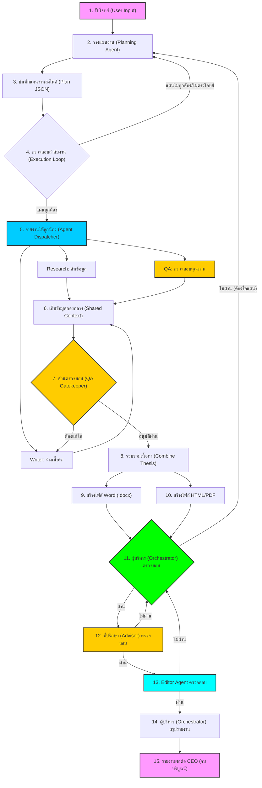

# 📊 Thesis Automation System: Main Workflow

---

## 👨‍💼 รายละเอียดขั้นตอน (Executive Summary)

### 1. การวางแผน (Planning Phase)
*   **Planning Agent:** วางแผนงานตามโจทย์ที่ได้รับจาก CEO ผ่าน Orchestrator

### 2. การคุมคุณภาพและขัดเกลา (QC & Polishing)
*   **QA & Advisor:** ตรวจสอบความถูกต้องทางเทคนิคและวิชาการ
*   **Editor Agent:** ขัดเกลาภาษาให้สละสลวยในด่านสุดท้าย

### 3. การรายงานผลระดับสูง (Executive Reporting)
*   **Orchestrator Summary:** ผู้บริหารรวบรวมความสำเร็จและตรวจสอบความเรียบร้อยทั้งหมด
*   **CEO Delivery:** ส่งมอบผลงานที่สมบูรณ์แบบที่สุดถึงมือ CEO เพื่อปิดโครงการอย่างเป็นทางการ (จบบริบูรณ์)
